# NiFi Metadata Platform - Architecture Diagrams

**Version:** 1.0  
**Date:** February 26, 2026

---

## System Context Diagram

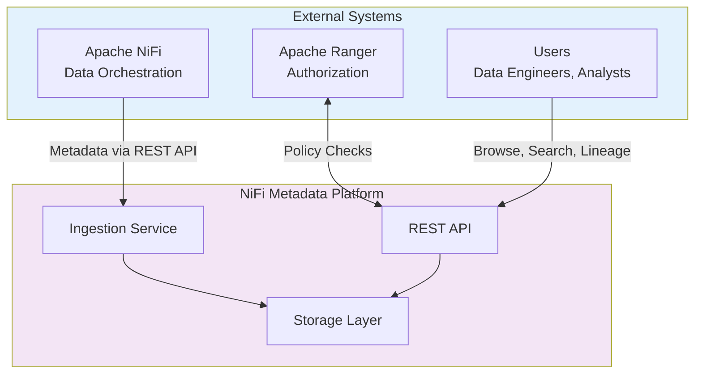
```mermaid
flowchart TB
    subgraph external [External Systems]
        nifi[Apache NiFi<br/>Data Orchestration]
        ranger[Apache Ranger<br/>Authorization]
        users[Users<br/>Data Engineers, Analysts]
    end
    
    subgraph platform [NiFi Metadata Platform]
        api[REST API]
        storage[Storage Layer]
        ingestion[Ingestion Service]
    end
    
    nifi -->|"Metadata via REST API"| ingestion
    ranger <-->|"Policy Checks"| api
    users -->|"Browse, Search, Lineage"| api
    
    ingestion --> storage
    api --> storage
    
    style external fill:#e3f2fd
    style platform fill:#f3e5f5
```

---

## Split Storage Architecture - Detailed

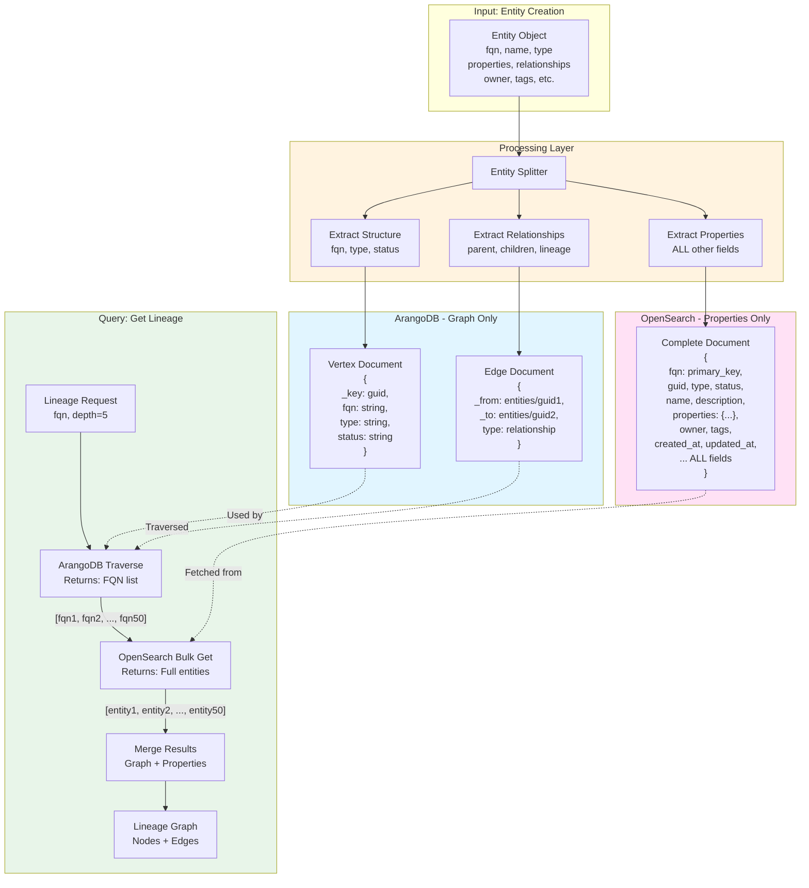
```mermaid
flowchart TB
    subgraph input [Input: Entity Creation]
        entity["Entity Object<br/>fqn, name, type<br/>properties, relationships<br/>owner, tags, etc."]
    end
    
    subgraph processor [Processing Layer]
        splitter[Entity Splitter]
        structExtract[Extract Structure<br/>fqn, type, status]
        propsExtract[Extract Properties<br/>ALL other fields]
        relExtract[Extract Relationships<br/>parent, children, lineage]
    end
    
    subgraph arango [ArangoDB - Graph Only]
        vertex["Vertex Document<br/>{<br/>  _key: guid,<br/>  fqn: string,<br/>  type: string,<br/>  status: string<br/>}"]
        edge["Edge Document<br/>{<br/>  _from: entities/guid1,<br/>  _to: entities/guid2,<br/>  type: relationship<br/>}"]
    end
    
    subgraph opensearch [OpenSearch - Properties Only]
        doc["Complete Document<br/>{<br/>  fqn: primary_key,<br/>  guid, type, status,<br/>  name, description,<br/>  properties: {...},<br/>  owner, tags,<br/>  created_at, updated_at,<br/>  ... ALL fields<br/>}"]
    end
    
    subgraph query [Query: Get Lineage]
        lineageQuery[Lineage Request<br/>fqn, depth=5]
        graphTraverse[ArangoDB Traverse<br/>Returns: FQN list]
        bulkFetch[OpenSearch Bulk Get<br/>Returns: Full entities]
        merge[Merge Results<br/>Graph + Properties]
        result[Lineage Graph<br/>Nodes + Edges]
    end
    
    entity --> splitter
    splitter --> structExtract
    splitter --> propsExtract
    splitter --> relExtract
    
    structExtract --> vertex
    relExtract --> edge
    propsExtract --> doc
    
    lineageQuery --> graphTraverse
    graphTraverse -->|"[fqn1, fqn2, ..., fqn50]"| bulkFetch
    vertex -.->|"Used by"| graphTraverse
    edge -.->|"Traversed"| graphTraverse
    
    bulkFetch -->|"[entity1, entity2, ..., entity50]"| merge
    doc -.->|"Fetched from"| bulkFetch
    
    merge --> result
    
    style arango fill:#e1f5ff
    style opensearch fill:#ffe1f5
    style processor fill:#fff3e0
    style query fill:#e8f5e9
```

---

## Real-Time Synchronization Flow

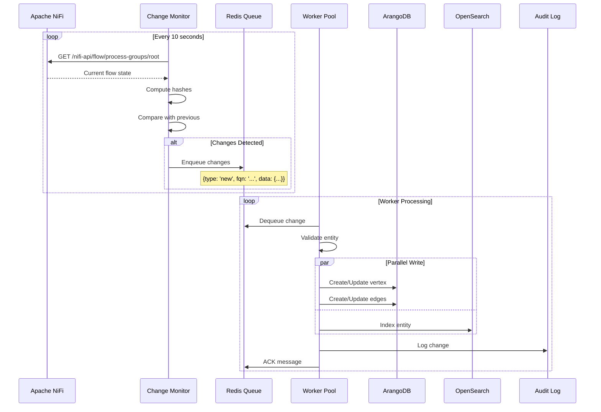
```mermaid
sequenceDiagram
    participant NiFi as Apache NiFi
    participant Monitor as Change Monitor
    participant Queue as Redis Queue
    participant Worker as Worker Pool
    participant Arango as ArangoDB
    participant OS as OpenSearch
    participant Audit as Audit Log
    
    loop Every 10 seconds
        Monitor->>NiFi: GET /nifi-api/flow/process-groups/root
        NiFi-->>Monitor: Current flow state
        Monitor->>Monitor: Compute hashes
        Monitor->>Monitor: Compare with previous
        
        alt Changes Detected
            Monitor->>Queue: Enqueue changes
            Note over Queue: {type: 'new', fqn: '...', data: {...}}
        end
    end
    
    loop Worker Processing
        Worker->>Queue: Dequeue change
        Worker->>Worker: Validate entity
        
        par Parallel Write
            Worker->>Arango: Create/Update vertex
            Worker->>Arango: Create/Update edges
        and
            Worker->>OS: Index entity
        end
        
        Worker->>Audit: Log change
        Worker->>Queue: ACK message
    end
```

---

## Lineage Query Optimization

```mermaid
flowchart TB
    subgraph request [Lineage Request]
        req["GET /lineage/table1?depth=10"]
    end
    
    subgraph cache [Cache Layers]
        l1[L1: In-Memory<br/>Hot lineage graphs<br/>TTL: 1 min]
        l2[L2: Redis<br/>Recent queries<br/>TTL: 5 min]
    end
    
    subgraph compute [Compute Path]
        arango[ArangoDB Traverse<br/>Get FQN list]
        opensearch[OpenSearch Bulk Fetch<br/>Get properties]
        build[Build Graph]
    end
    
    subgraph response [Response]
        graph[Lineage Graph<br/>Nodes + Edges]
    end
    
    req --> l1
    l1 -->|"Hit"| graph
    l1 -->|"Miss"| l2
    l2 -->|"Hit"| graph
    l2 -->|"Miss"| arango
    
    arango -->|"50 FQNs in 50ms"| opensearch
    opensearch -->|"50 entities in 80ms"| build
    build -->|"Total: 130ms"| graph
    
    build -.->|"Cache"| l2
    build -.->|"Cache"| l1
    
    style cache fill:#e1ffe1
    style compute fill:#ffe1e1
```

**Performance Breakdown:**

```
Without Cache:
  ArangoDB traverse: 50ms
  OpenSearch bulk fetch: 80ms
  Graph building: 20ms
  Total: 150ms

With L2 Cache (Redis):
  Redis fetch: 10ms
  Total: 10ms
  Speedup: 15x

With L1 Cache (In-Memory):
  Memory fetch: 1ms
  Total: 1ms
  Speedup: 150x
```

---

## Consistency Architecture

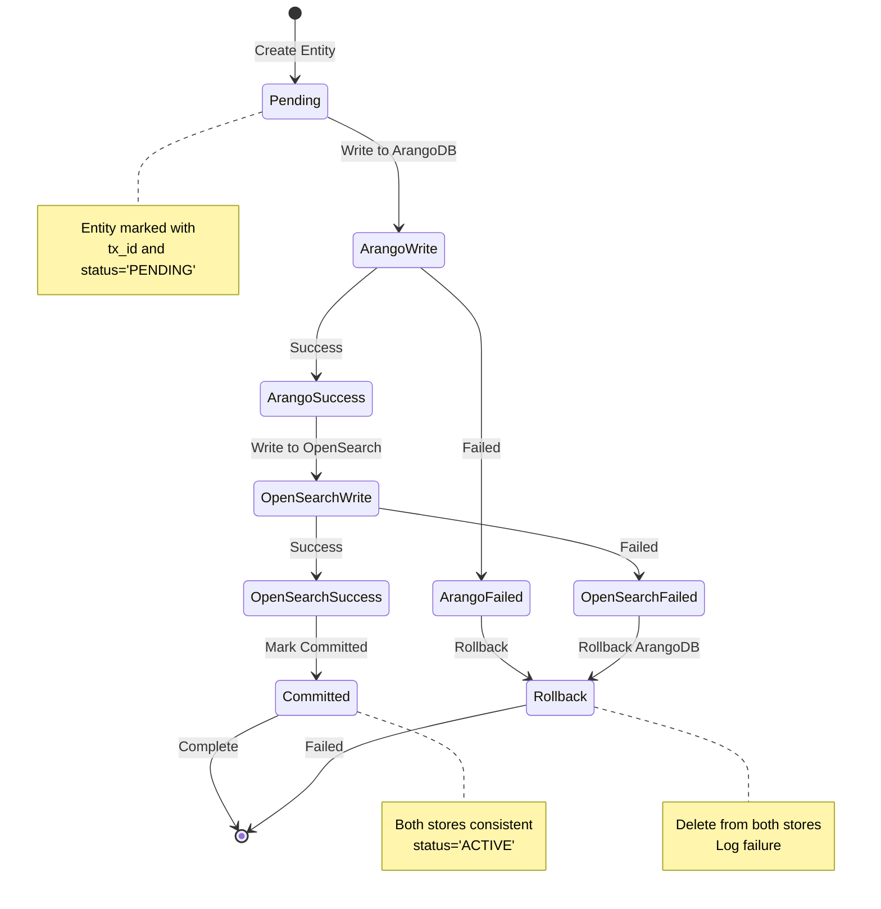
```mermaid
stateDiagram-v2
    [*] --> Pending: Create Entity
    
    Pending --> ArangoWrite: Write to ArangoDB
    ArangoWrite --> ArangoSuccess: Success
    ArangoWrite --> ArangoFailed: Failed
    
    ArangoSuccess --> OpenSearchWrite: Write to OpenSearch
    OpenSearchWrite --> OpenSearchSuccess: Success
    OpenSearchWrite --> OpenSearchFailed: Failed
    
    OpenSearchSuccess --> Committed: Mark Committed
    Committed --> [*]: Complete
    
    ArangoFailed --> Rollback: Rollback
    OpenSearchFailed --> Rollback: Rollback ArangoDB
    Rollback --> [*]: Failed
    
    note right of Pending
        Entity marked with
        tx_id and status='PENDING'
    end note
    
    note right of Committed
        Both stores consistent
        status='ACTIVE'
    end note
    
    note right of Rollback
        Delete from both stores
        Log failure
    end note
```

### Reconciliation Process

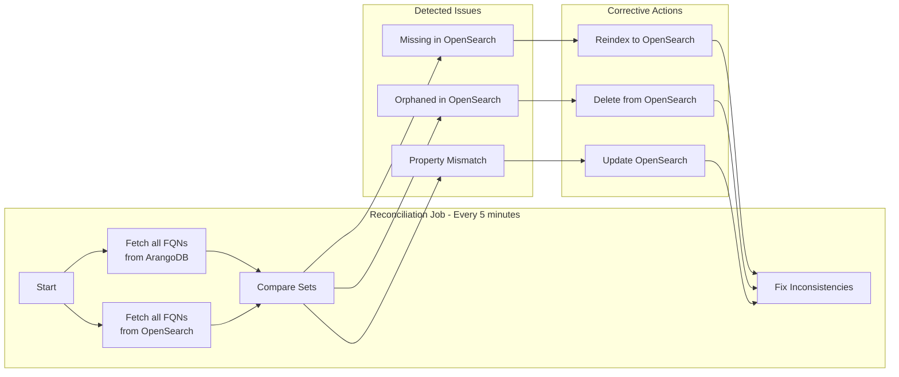
```mermaid
flowchart LR
    subgraph job [Reconciliation Job - Every 5 minutes]
        start[Start]
        fetchArango[Fetch all FQNs<br/>from ArangoDB]
        fetchOS[Fetch all FQNs<br/>from OpenSearch]
        compare[Compare Sets]
        fix[Fix Inconsistencies]
    end
    
    subgraph issues [Detected Issues]
        missing[Missing in OpenSearch]
        orphaned[Orphaned in OpenSearch]
        mismatch[Property Mismatch]
    end
    
    subgraph actions [Corrective Actions]
        reindex[Reindex to OpenSearch]
        delete[Delete from OpenSearch]
        update[Update OpenSearch]
    end
    
    start --> fetchArango
    start --> fetchOS
    fetchArango --> compare
    fetchOS --> compare
    
    compare --> missing
    compare --> orphaned
    compare --> mismatch
    
    missing --> reindex
    orphaned --> delete
    mismatch --> update
    
    reindex --> fix
    delete --> fix
    update --> fix
```

---

## API Layer Architecture

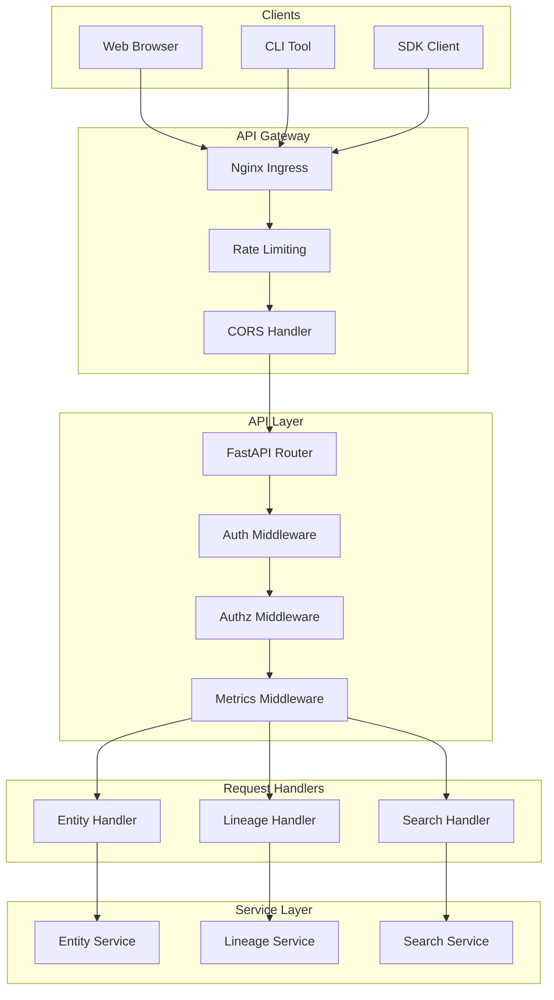
```mermaid
flowchart TB
    subgraph client [Clients]
        browser[Web Browser]
        cli[CLI Tool]
        sdk[SDK Client]
    end
    
    subgraph gateway [API Gateway]
        ingress[Nginx Ingress]
        rateLimit[Rate Limiting]
        cors[CORS Handler]
    end
    
    subgraph api [API Layer]
        router[FastAPI Router]
        auth[Auth Middleware]
        authz[Authz Middleware]
        metrics[Metrics Middleware]
    end
    
    subgraph handlers [Request Handlers]
        entityHandler[Entity Handler]
        lineageHandler[Lineage Handler]
        searchHandler[Search Handler]
    end
    
    subgraph services [Service Layer]
        entitySvc[Entity Service]
        lineageSvc[Lineage Service]
        searchSvc[Search Service]
    end
    
    browser --> ingress
    cli --> ingress
    sdk --> ingress
    
    ingress --> rateLimit
    rateLimit --> cors
    cors --> router
    
    router --> auth
    auth --> authz
    authz --> metrics
    
    metrics --> entityHandler
    metrics --> lineageHandler
    metrics --> searchHandler
    
    entityHandler --> entitySvc
    lineageHandler --> lineageSvc
    searchHandler --> searchSvc
```

---

## Storage Cluster Architecture

### ArangoDB Cluster

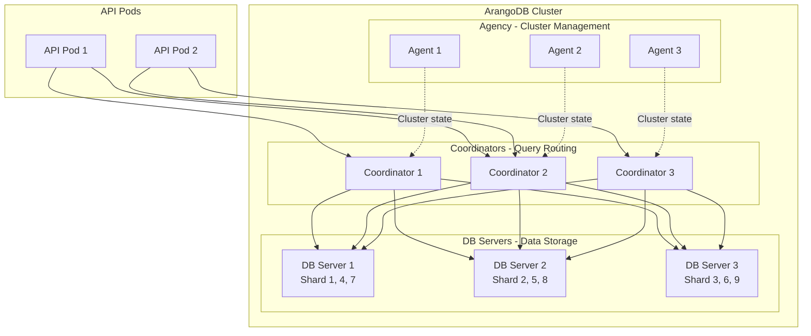
```mermaid
flowchart TB
    subgraph cluster [ArangoDB Cluster]
        subgraph coordinators [Coordinators - Query Routing]
            coord1[Coordinator 1]
            coord2[Coordinator 2]
            coord3[Coordinator 3]
        end
        
        subgraph dbservers [DB Servers - Data Storage]
            db1[DB Server 1<br/>Shard 1, 4, 7]
            db2[DB Server 2<br/>Shard 2, 5, 8]
            db3[DB Server 3<br/>Shard 3, 6, 9]
        end
        
        subgraph agency [Agency - Cluster Management]
            agent1[Agent 1]
            agent2[Agent 2]
            agent3[Agent 3]
        end
    end
    
    subgraph clients [API Pods]
        api1[API Pod 1]
        api2[API Pod 2]
    end
    
    api1 --> coord1
    api1 --> coord2
    api2 --> coord2
    api2 --> coord3
    
    coord1 --> db1
    coord1 --> db2
    coord1 --> db3
    
    coord2 --> db1
    coord2 --> db2
    coord2 --> db3
    
    coord3 --> db1
    coord3 --> db2
    coord3 --> db3
    
    agent1 -.->|"Cluster state"| coord1
    agent2 -.->|"Cluster state"| coord2
    agent3 -.->|"Cluster state"| coord3
```

**Sharding Strategy:**
```javascript
// Shard by entity type for even distribution
db._create("entities", {
  numberOfShards: 9,
  shardKeys: ["type"],
  replicationFactor: 2
});
```

### OpenSearch Cluster

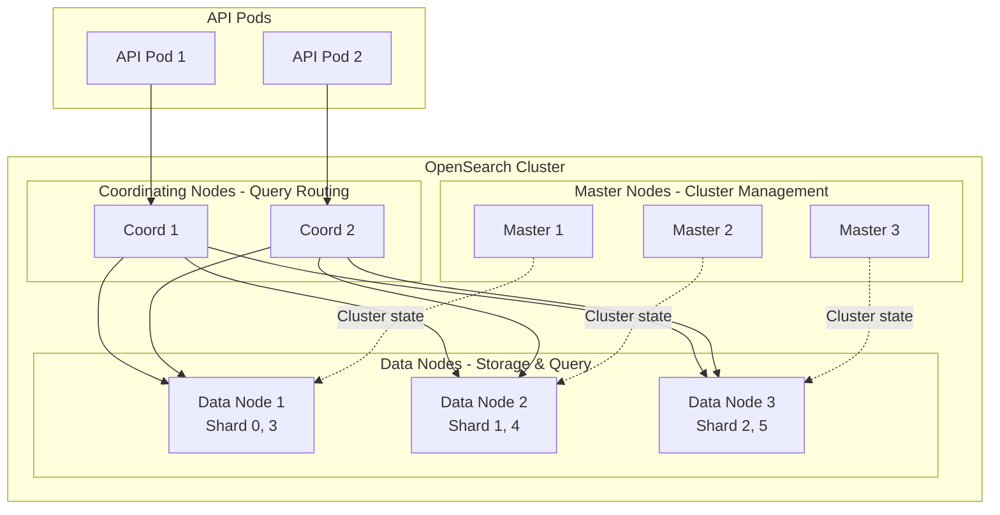
```mermaid
flowchart TB
    subgraph cluster [OpenSearch Cluster]
        subgraph masters [Master Nodes - Cluster Management]
            master1[Master 1]
            master2[Master 2]
            master3[Master 3]
        end
        
        subgraph data [Data Nodes - Storage & Query]
            data1[Data Node 1<br/>Shard 0, 3]
            data2[Data Node 2<br/>Shard 1, 4]
            data3[Data Node 3<br/>Shard 2, 5]
        end
        
        subgraph coordinating [Coordinating Nodes - Query Routing]
            coord1[Coord 1]
            coord2[Coord 2]
        end
    end
    
    subgraph clients [API Pods]
        api1[API Pod 1]
        api2[API Pod 2]
    end
    
    api1 --> coord1
    api2 --> coord2
    
    coord1 --> data1
    coord1 --> data2
    coord1 --> data3
    
    coord2 --> data1
    coord2 --> data2
    coord2 --> data3
    
    master1 -.->|"Cluster state"| data1
    master2 -.->|"Cluster state"| data2
    master3 -.->|"Cluster state"| data3
```

**Index Configuration:**
```json
{
  "settings": {
    "number_of_shards": 5,
    "number_of_replicas": 1,
    "refresh_interval": "5s"
  }
}
```

---

## Data Consistency Patterns

### Pattern 1: Two-Phase Commit (Strong Consistency)

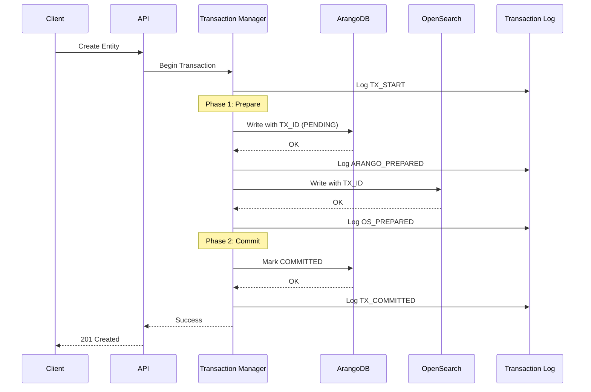
```mermaid
sequenceDiagram
    participant Client
    participant API
    participant TxManager as Transaction Manager
    participant Arango as ArangoDB
    participant OS as OpenSearch
    participant Log as Transaction Log
    
    Client->>API: Create Entity
    API->>TxManager: Begin Transaction
    TxManager->>Log: Log TX_START
    
    Note over TxManager: Phase 1: Prepare
    TxManager->>Arango: Write with TX_ID (PENDING)
    Arango-->>TxManager: OK
    TxManager->>Log: Log ARANGO_PREPARED
    
    TxManager->>OS: Write with TX_ID
    OS-->>TxManager: OK
    TxManager->>Log: Log OS_PREPARED
    
    Note over TxManager: Phase 2: Commit
    TxManager->>Arango: Mark COMMITTED
    Arango-->>TxManager: OK
    TxManager->>Log: Log TX_COMMITTED
    
    TxManager-->>API: Success
    API-->>Client: 201 Created
```

### Pattern 2: Eventual Consistency (High Performance)

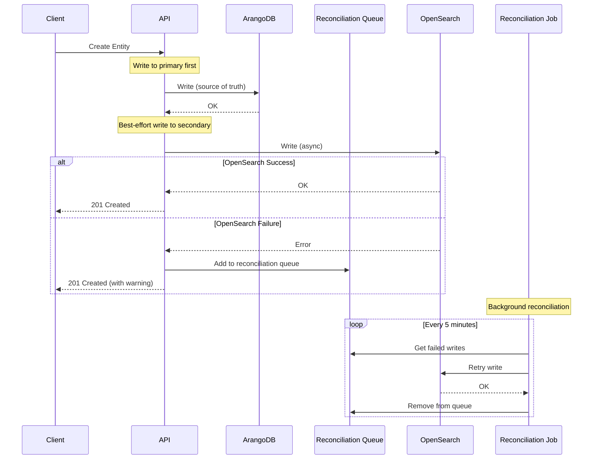
```mermaid
sequenceDiagram
    participant Client
    participant API
    participant Arango as ArangoDB
    participant Queue as Reconciliation Queue
    participant OS as OpenSearch
    participant Job as Reconciliation Job
    
    Client->>API: Create Entity
    
    Note over API: Write to primary first
    API->>Arango: Write (source of truth)
    Arango-->>API: OK
    
    Note over API: Best-effort write to secondary
    API->>OS: Write (async)
    
    alt OpenSearch Success
        OS-->>API: OK
        API-->>Client: 201 Created
    else OpenSearch Failure
        OS-->>API: Error
        API->>Queue: Add to reconciliation queue
        API-->>Client: 201 Created (with warning)
    end
    
    Note over Job: Background reconciliation
    loop Every 5 minutes
        Job->>Queue: Get failed writes
        Job->>OS: Retry write
        OS-->>Job: OK
        Job->>Queue: Remove from queue
    end
```

---

## Authorization Flow with Ranger

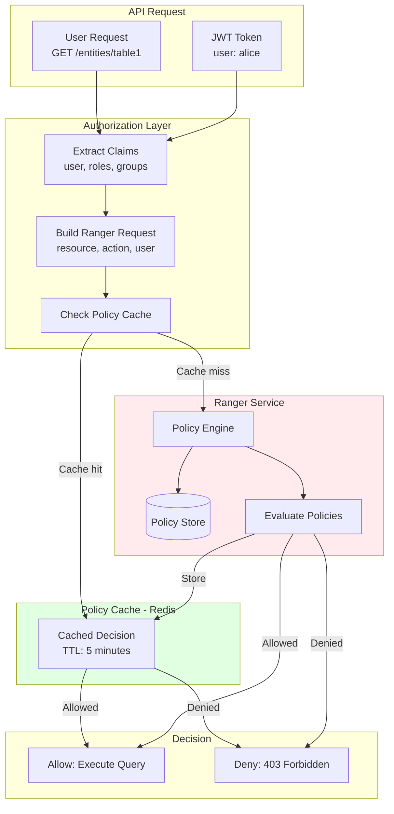
```mermaid
flowchart TB
    subgraph request [API Request]
        user[User Request<br/>GET /entities/table1]
        jwt[JWT Token<br/>user: alice]
    end
    
    subgraph authz [Authorization Layer]
        extract[Extract Claims<br/>user, roles, groups]
        buildReq[Build Ranger Request<br/>resource, action, user]
        checkCache[Check Policy Cache]
    end
    
    subgraph ranger [Ranger Service]
        policies[(Policy Store)]
        engine[Policy Engine]
        evaluate[Evaluate Policies]
    end
    
    subgraph cache [Policy Cache - Redis]
        cached[Cached Decision<br/>TTL: 5 minutes]
    end
    
    subgraph decision [Decision]
        allow[Allow: Execute Query]
        deny[Deny: 403 Forbidden]
    end
    
    user --> extract
    jwt --> extract
    extract --> buildReq
    buildReq --> checkCache
    
    checkCache -->|"Cache hit"| cached
    checkCache -->|"Cache miss"| engine
    
    engine --> policies
    engine --> evaluate
    evaluate -->|"Store"| cached
    
    cached -->|"Allowed"| allow
    cached -->|"Denied"| deny
    evaluate -->|"Allowed"| allow
    evaluate -->|"Denied"| deny
    
    style ranger fill:#ffebee
    style cache fill:#e1ffe1
```

**Ranger Request Format:**
```json
{
  "requestId": "req-12345",
  "resource": {
    "entity-type": "nifi_processor",
    "entity-fqn": "nifi://container/w1/processor/abc123"
  },
  "accessType": "read",
  "user": "alice",
  "userGroups": ["data_team", "analysts"],
  "clientIPAddress": "10.0.1.45",
  "accessTime": "2026-02-26T10:30:00Z"
}
```

**Ranger Response:**
```json
{
  "allowed": true,
  "policyId": 123,
  "policyVersion": 5,
  "reason": "Matched policy: nifi-read-access"
}
```

---

## Kubernetes Deployment Architecture

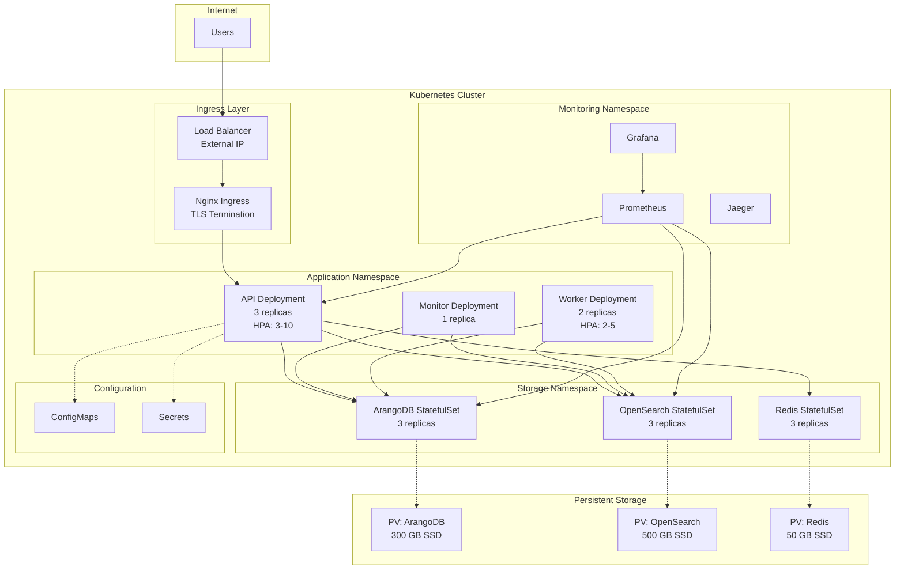
```mermaid
flowchart TB
    subgraph internet [Internet]
        users[Users]
    end
    
    subgraph k8s [Kubernetes Cluster]
        subgraph ingress [Ingress Layer]
            lb[Load Balancer<br/>External IP]
            nginx[Nginx Ingress<br/>TLS Termination]
        end
        
        subgraph app [Application Namespace]
            apiDeploy[API Deployment<br/>3 replicas<br/>HPA: 3-10]
            monitorDeploy[Monitor Deployment<br/>1 replica]
            workerDeploy[Worker Deployment<br/>2 replicas<br/>HPA: 2-5]
        end
        
        subgraph storage [Storage Namespace]
            arangoSts[ArangoDB StatefulSet<br/>3 replicas]
            osSts[OpenSearch StatefulSet<br/>3 replicas]
            redisSts[Redis StatefulSet<br/>3 replicas]
        end
        
        subgraph config [Configuration]
            cm[ConfigMaps]
            secrets[Secrets]
        end
        
        subgraph monitoring [Monitoring Namespace]
            prom[Prometheus]
            grafana[Grafana]
            jaeger[Jaeger]
        end
    end
    
    subgraph volumes [Persistent Storage]
        pv1[PV: ArangoDB<br/>300 GB SSD]
        pv2[PV: OpenSearch<br/>500 GB SSD]
        pv3[PV: Redis<br/>50 GB SSD]
    end
    
    users --> lb
    lb --> nginx
    nginx --> apiDeploy
    
    apiDeploy --> arangoSts
    apiDeploy --> osSts
    apiDeploy --> redisSts
    
    monitorDeploy --> arangoSts
    monitorDeploy --> osSts
    
    workerDeploy --> arangoSts
    workerDeploy --> osSts
    
    apiDeploy -.-> cm
    apiDeploy -.-> secrets
    
    prom --> apiDeploy
    prom --> arangoSts
    prom --> osSts
    
    grafana --> prom
    
    arangoSts -.-> pv1
    osSts -.-> pv2
    redisSts -.-> pv3
```

---

## Horizontal Pod Autoscaling

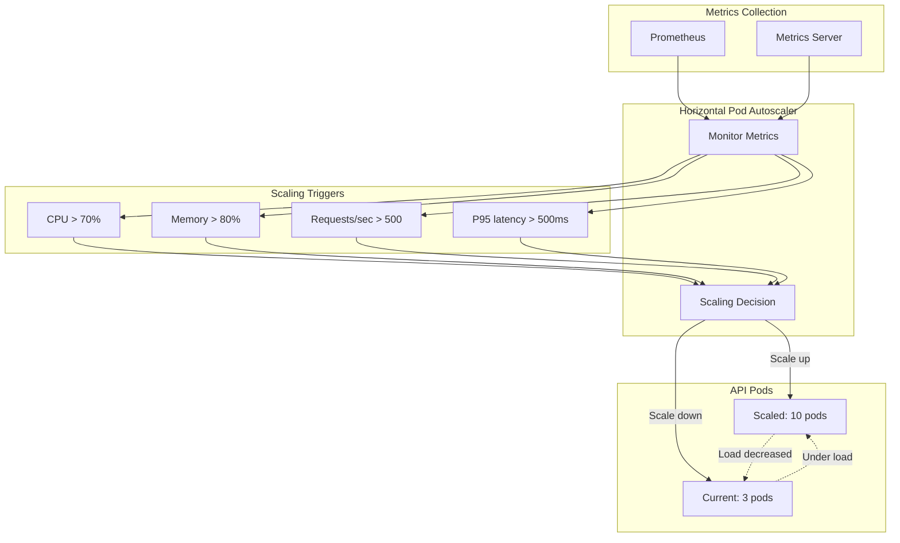
```mermaid
flowchart TB
    subgraph metrics [Metrics Collection]
        prom[Prometheus]
        metricsServer[Metrics Server]
    end
    
    subgraph hpa [Horizontal Pod Autoscaler]
        monitor[Monitor Metrics]
        decide[Scaling Decision]
    end
    
    subgraph pods [API Pods]
        current[Current: 3 pods]
        scaled[Scaled: 10 pods]
    end
    
    subgraph triggers [Scaling Triggers]
        cpu[CPU > 70%]
        mem[Memory > 80%]
        rps[Requests/sec > 500]
        latency[P95 latency > 500ms]
    end
    
    prom --> monitor
    metricsServer --> monitor
    
    monitor --> cpu
    monitor --> mem
    monitor --> rps
    monitor --> latency
    
    cpu --> decide
    mem --> decide
    rps --> decide
    latency --> decide
    
    decide -->|"Scale up"| scaled
    decide -->|"Scale down"| current
    
    current -.->|"Under load"| scaled
    scaled -.->|"Load decreased"| current
```

**HPA Configuration:**
```yaml
apiVersion: autoscaling/v2
kind: HorizontalPodAutoscaler
metadata:
  name: api-hpa
spec:
  scaleTargetRef:
    apiVersion: apps/v1
    kind: Deployment
    name: nifi-metadata-api
  minReplicas: 3
  maxReplicas: 10
  metrics:
  - type: Resource
    resource:
      name: cpu
      target:
        type: Utilization
        averageUtilization: 70
  - type: Resource
    resource:
      name: memory
      target:
        type: Utilization
        averageUtilization: 80
  - type: Pods
    pods:
      metric:
        name: http_requests_per_second
      target:
        type: AverageValue
        averageValue: "500"
```

---

## Monitoring & Alerting Architecture

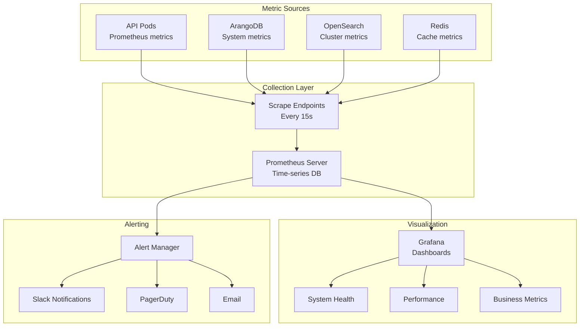
```mermaid
flowchart TB
    subgraph sources [Metric Sources]
        api[API Pods<br/>Prometheus metrics]
        arango[ArangoDB<br/>System metrics]
        opensearch[OpenSearch<br/>Cluster metrics]
        redis[Redis<br/>Cache metrics]
    end
    
    subgraph collection [Collection Layer]
        promServer[Prometheus Server<br/>Time-series DB]
        scrape[Scrape Endpoints<br/>Every 15s]
    end
    
    subgraph visualization [Visualization]
        grafana[Grafana<br/>Dashboards]
        dash1[System Health]
        dash2[Performance]
        dash3[Business Metrics]
    end
    
    subgraph alerting [Alerting]
        alertMgr[Alert Manager]
        slack[Slack Notifications]
        pagerduty[PagerDuty]
        email[Email]
    end
    
    api --> scrape
    arango --> scrape
    opensearch --> scrape
    redis --> scrape
    
    scrape --> promServer
    
    promServer --> grafana
    promServer --> alertMgr
    
    grafana --> dash1
    grafana --> dash2
    grafana --> dash3
    
    alertMgr --> slack
    alertMgr --> pagerduty
    alertMgr --> email
```

**Alert Rules:**
```yaml
groups:
- name: nifi_metadata_alerts
  interval: 30s
  rules:
  - alert: HighErrorRate
    expr: rate(api_requests_total{status=~"5.."}[5m]) > 0.05
    for: 5m
    labels:
      severity: critical
    annotations:
      summary: "High error rate detected"
      description: "Error rate is {{ $value }} req/s"
  
  - alert: SlowLineageQueries
    expr: histogram_quantile(0.95, rate(lineage_query_duration_seconds_bucket[5m])) > 1.0
    for: 10m
    labels:
      severity: warning
    annotations:
      summary: "Slow lineage queries"
      description: "P95 latency is {{ $value }}s"
  
  - alert: ArangoDBDown
    expr: up{job="arangodb"} == 0
    for: 1m
    labels:
      severity: critical
    annotations:
      summary: "ArangoDB is down"
  
  - alert: OpenSearchDown
    expr: up{job="opensearch"} == 0
    for: 1m
    labels:
      severity: critical
    annotations:
      summary: "OpenSearch is down"
```

---

## Disaster Recovery Architecture

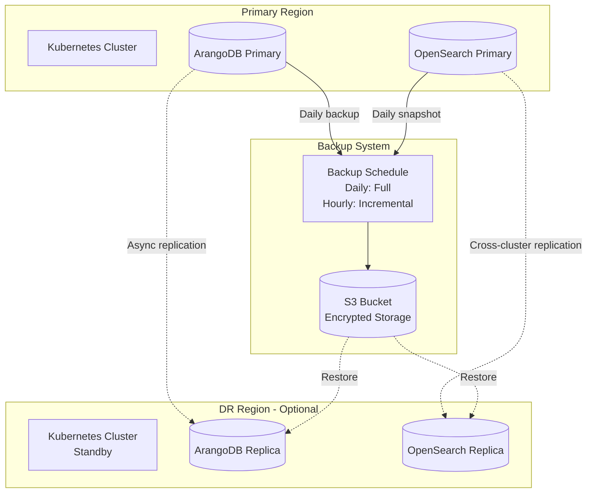
```mermaid
flowchart TB
    subgraph primary [Primary Region]
        primaryK8s[Kubernetes Cluster]
        primaryArango[(ArangoDB Primary)]
        primaryOS[(OpenSearch Primary)]
    end
    
    subgraph backup [Backup System]
        schedule[Backup Schedule<br/>Daily: Full<br/>Hourly: Incremental]
        s3[(S3 Bucket<br/>Encrypted Storage)]
    end
    
    subgraph dr [DR Region - Optional]
        drK8s[Kubernetes Cluster<br/>Standby]
        drArango[(ArangoDB Replica)]
        drOS[(OpenSearch Replica)]
    end
    
    primaryArango -->|"Daily backup"| schedule
    primaryOS -->|"Daily snapshot"| schedule
    schedule --> s3
    
    primaryArango -.->|"Async replication"| drArango
    primaryOS -.->|"Cross-cluster replication"| drOS
    
    s3 -.->|"Restore"| drArango
    s3 -.->|"Restore"| drOS
```

**Recovery Procedures:**

| Scenario | RTO | RPO | Procedure |
|----------|-----|-----|-----------|
| **Pod failure** | < 1 min | 0 | K8s auto-restart |
| **Node failure** | < 5 min | 0 | K8s reschedule pods |
| **ArangoDB failure** | < 10 min | 0 | Cluster failover |
| **OpenSearch failure** | < 10 min | 0 | Cluster failover |
| **Data corruption** | < 1 hour | 24 hours | Restore from backup |
| **Region failure** | < 4 hours | 1 hour | Failover to DR region |

---

## Security Architecture

### Network Security

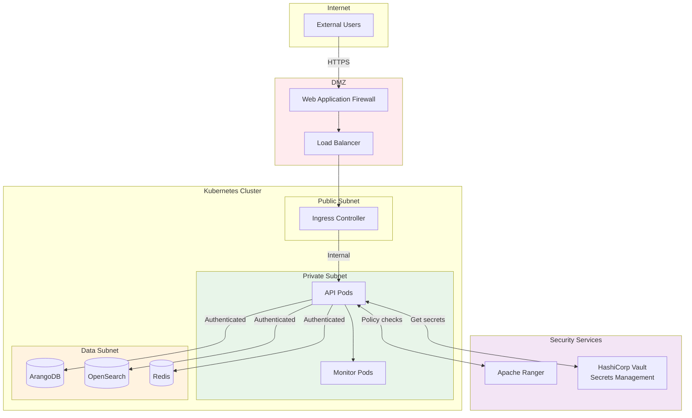
```mermaid
flowchart TB
    subgraph internet [Internet]
        users[External Users]
    end
    
    subgraph dmz [DMZ]
        waf[Web Application Firewall]
        lb[Load Balancer]
    end
    
    subgraph k8s [Kubernetes Cluster]
        subgraph public [Public Subnet]
            ingress[Ingress Controller]
        end
        
        subgraph private [Private Subnet]
            api[API Pods]
            monitor[Monitor Pods]
        end
        
        subgraph data [Data Subnet]
            arango[(ArangoDB)]
            opensearch[(OpenSearch)]
            redis[(Redis)]
        end
    end
    
    subgraph security [Security Services]
        ranger[Apache Ranger]
        vault[HashiCorp Vault<br/>Secrets Management]
    end
    
    users -->|"HTTPS"| waf
    waf --> lb
    lb --> ingress
    
    ingress -->|"Internal"| api
    api --> monitor
    
    api -->|"Authenticated"| arango
    api -->|"Authenticated"| opensearch
    api -->|"Authenticated"| redis
    
    api <-->|"Policy checks"| ranger
    api <-->|"Get secrets"| vault
    
    style dmz fill:#ffebee
    style private fill:#e8f5e9
    style data fill:#fff3e0
    style security fill:#f3e5f5
```

### Data Encryption

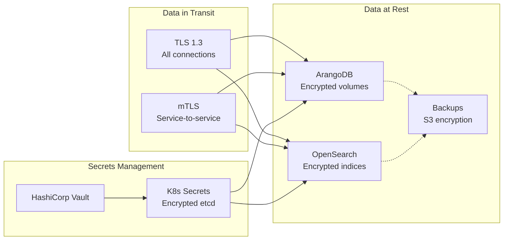
```mermaid
flowchart LR
    subgraph transit [Data in Transit]
        tls[TLS 1.3<br/>All connections]
        mtls[mTLS<br/>Service-to-service]
    end
    
    subgraph rest [Data at Rest]
        arangoEnc[ArangoDB<br/>Encrypted volumes]
        osEnc[OpenSearch<br/>Encrypted indices]
        backupEnc[Backups<br/>S3 encryption]
    end
    
    subgraph secrets [Secrets Management]
        vault[HashiCorp Vault]
        k8sSecrets[K8s Secrets<br/>Encrypted etcd]
    end
    
    tls --> arangoEnc
    tls --> osEnc
    mtls --> arangoEnc
    mtls --> osEnc
    
    vault --> k8sSecrets
    k8sSecrets --> arangoEnc
    k8sSecrets --> osEnc
    
    arangoEnc -.-> backupEnc
    osEnc -.-> backupEnc
```

---

## Performance Optimization Strategies

### Query Optimization Pipeline

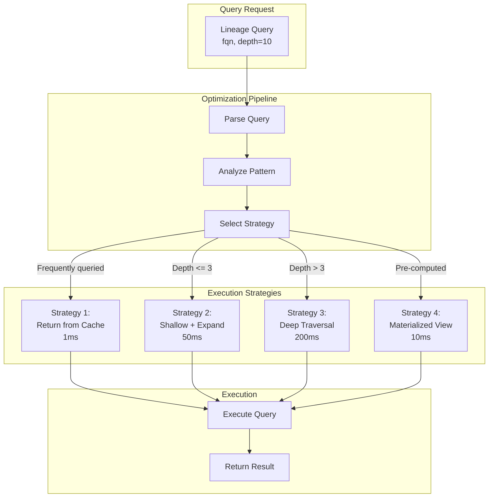
```mermaid
flowchart TB
    subgraph request [Query Request]
        query[Lineage Query<br/>fqn, depth=10]
    end
    
    subgraph optimization [Optimization Pipeline]
        parse[Parse Query]
        analyze[Analyze Pattern]
        selectStrategy[Select Strategy]
    end
    
    subgraph strategies [Execution Strategies]
        cached[Strategy 1:<br/>Return from Cache<br/>1ms]
        shallow[Strategy 2:<br/>Shallow + Expand<br/>50ms]
        deep[Strategy 3:<br/>Deep Traversal<br/>200ms]
        materialized[Strategy 4:<br/>Materialized View<br/>10ms]
    end
    
    subgraph execution [Execution]
        execute[Execute Query]
        result[Return Result]
    end
    
    query --> parse
    parse --> analyze
    analyze --> selectStrategy
    
    selectStrategy -->|"Frequently queried"| cached
    selectStrategy -->|"Depth <= 3"| shallow
    selectStrategy -->|"Depth > 3"| deep
    selectStrategy -->|"Pre-computed"| materialized
    
    cached --> execute
    shallow --> execute
    deep --> execute
    materialized --> execute
    
    execute --> result
```

### Caching Strategy

```mermaid
flowchart TB
    subgraph cache [Multi-Level Cache Architecture]
        subgraph l1 [L1: Application Memory]
            lru[LRU Cache<br/>1000 entities<br/>TTL: 1 min]
        end
        
        subgraph l2 [L2: Redis Cluster]
            hot[Hot Data<br/>10K entities<br/>TTL: 5 min]
            lineage[Lineage Graphs<br/>1K graphs<br/>TTL: 5 min]
            search[Search Results<br/>5K queries<br/>TTL: 2 min]
        end
        
        subgraph l3 [L3: OpenSearch]
            entities[All Entities<br/>Indexed]
        end
        
        subgraph l4 [L4: ArangoDB]
            graph[Graph Structure<br/>Source of Truth]
        end
    end
    
    subgraph stats [Cache Statistics]
        hitRate[Hit Rate: 85%]
        missRate[Miss Rate: 15%]
        eviction[Eviction Rate: 5%]
    end
    
    lru -->|"Miss"| hot
    hot -->|"Miss"| entities
    entities -->|"Miss"| graph
    
    graph -.->|"Populate"| entities
    entities -.->|"Populate"| hot
    hot -.->|"Populate"| lru
    
    lru -.-> hitRate
    hot -.-> hitRate
    entities -.-> missRate
```

---

## Testing Architecture

```mermaid
flowchart TB
    subgraph tests [Test Pyramid]
        subgraph unit [Unit Tests - 70%]
            services[Service Tests<br/>Mock dependencies]
            repos[Repository Tests<br/>Mock databases]
            models[Model Tests<br/>Validation]
        end
        
        subgraph integration [Integration Tests - 20%]
            api[API Tests<br/>Real databases]
            flow[End-to-end Flows<br/>Full stack]
        end
        
        subgraph e2e [E2E Tests - 10%]
            scenarios[User Scenarios<br/>Production-like]
            performance[Performance Tests<br/>Load testing]
        end
    end
    
    subgraph ci [CI/CD Pipeline]
        commit[Git Commit]
        build[Build & Lint]
        unitRun[Run Unit Tests]
        integrationRun[Run Integration Tests]
        deploy[Deploy to Staging]
        e2eRun[Run E2E Tests]
        prod[Deploy to Production]
    end
    
    commit --> build
    build --> unitRun
    unitRun --> integrationRun
    integrationRun --> deploy
    deploy --> e2eRun
    e2eRun --> prod
    
    services -.-> unitRun
    repos -.-> unitRun
    models -.-> unitRun
    
    api -.-> integrationRun
    flow -.-> integrationRun
    
    scenarios -.-> e2eRun
    performance -.-> e2eRun
```

---

## CI/CD Pipeline

```mermaid
flowchart LR
    subgraph dev [Development]
        code[Code Changes]
        commit[Git Commit]
        pr[Pull Request]
    end
    
    subgraph ci [Continuous Integration]
        build[Build Docker Image]
        test[Run Tests]
        scan[Security Scan]
        push[Push to Registry]
    end
    
    subgraph cd [Continuous Deployment]
        staging[Deploy to Staging]
        validate[Validation Tests]
        approve[Manual Approval]
        prod[Deploy to Production]
    end
    
    subgraph monitoring [Post-Deployment]
        health[Health Checks]
        smoke[Smoke Tests]
        rollback[Rollback if Failed]
    end
    
    code --> commit
    commit --> pr
    pr --> build
    
    build --> test
    test --> scan
    scan --> push
    
    push --> staging
    staging --> validate
    validate --> approve
    approve --> prod
    
    prod --> health
    health --> smoke
    smoke -->|"Failed"| rollback
    rollback -.-> staging
```

---

## Scalability Patterns

### Read Scaling

```mermaid
flowchart TB
    subgraph load [Load Distribution]
        req1[Request 1]
        req2[Request 2]
        req3[Request 3]
        reqN[Request N]
    end
    
    subgraph lb [Load Balancer]
        nginx[Nginx<br/>Round-robin]
    end
    
    subgraph api [API Pods - Stateless]
        api1[API Pod 1]
        api2[API Pod 2]
        api3[API Pod 3]
    end
    
    subgraph cache [Cache Layer]
        redis[Redis Cluster<br/>Distributed cache]
    end
    
    subgraph storage [Storage Layer]
        arangoRead[ArangoDB<br/>Read replicas]
        osRead[OpenSearch<br/>Read replicas]
    end
    
    req1 --> nginx
    req2 --> nginx
    req3 --> nginx
    reqN --> nginx
    
    nginx --> api1
    nginx --> api2
    nginx --> api3
    
    api1 --> redis
    api2 --> redis
    api3 --> redis
    
    redis -->|"Cache miss"| arangoRead
    redis -->|"Cache miss"| osRead
```

### Write Scaling

```mermaid
flowchart TB
    subgraph writes [Write Requests]
        w1[Write 1]
        w2[Write 2]
        w3[Write N]
    end
    
    subgraph queue [Write Queue]
        redis[Redis Queue<br/>Buffering]
    end
    
    subgraph workers [Worker Pool]
        worker1[Worker 1]
        worker2[Worker 2]
        worker3[Worker N]
    end
    
    subgraph storage [Storage Layer]
        arangoPrimary[ArangoDB Primary<br/>Write master]
        osPrimary[OpenSearch Primary<br/>Write master]
    end
    
    subgraph replication [Replication]
        arangoReplica[ArangoDB Replicas]
        osReplica[OpenSearch Replicas]
    end
    
    w1 --> redis
    w2 --> redis
    w3 --> redis
    
    redis --> worker1
    redis --> worker2
    redis --> worker3
    
    worker1 --> arangoPrimary
    worker1 --> osPrimary
    worker2 --> arangoPrimary
    worker2 --> osPrimary
    worker3 --> arangoPrimary
    worker3 --> osPrimary
    
    arangoPrimary -.->|"Async replication"| arangoReplica
    osPrimary -.->|"Async replication"| osReplica
```

---

## Summary

This architecture provides:

- **Split Storage:** ArangoDB (graph) + OpenSearch (properties)
- **Real-time Sync:** 10-second polling with change detection
- **High Performance:** < 200ms for 5-hop lineage with caching
- **Scalability:** Horizontal scaling for all components
- **Security:** Ranger integration with policy caching
- **Reliability:** 99.9% uptime with clustering and backups
- **Observability:** Comprehensive monitoring and alerting
- **Testing:** 80%+ coverage with unit, integration, and load tests
- **Kubernetes-native:** Production-ready K8s deployment

**Next Steps:** Review architecture → Approve → Begin implementation
