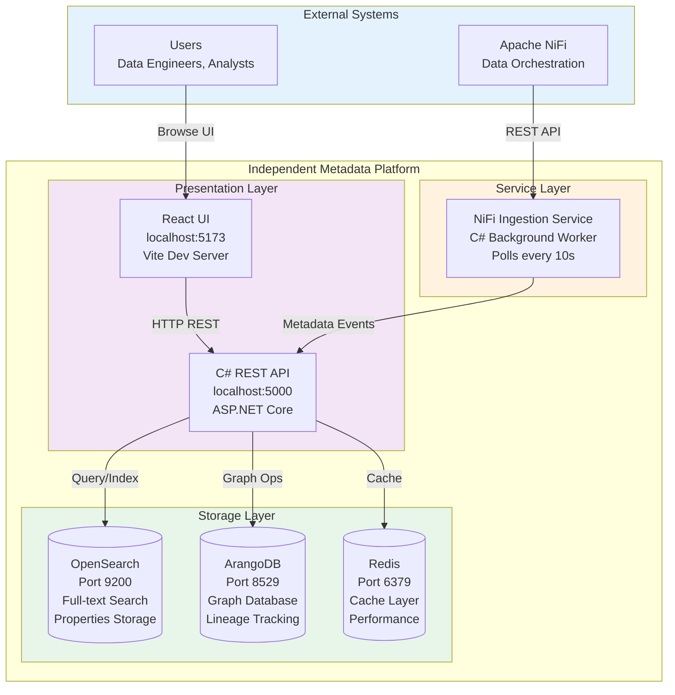
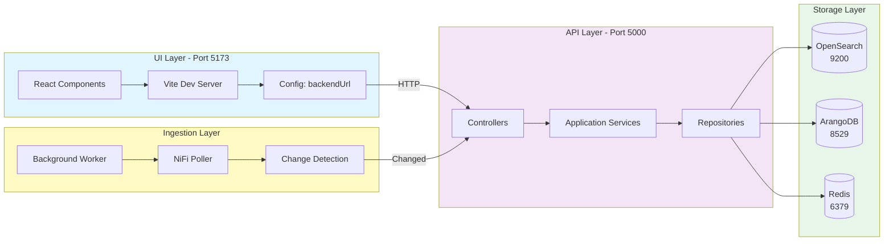
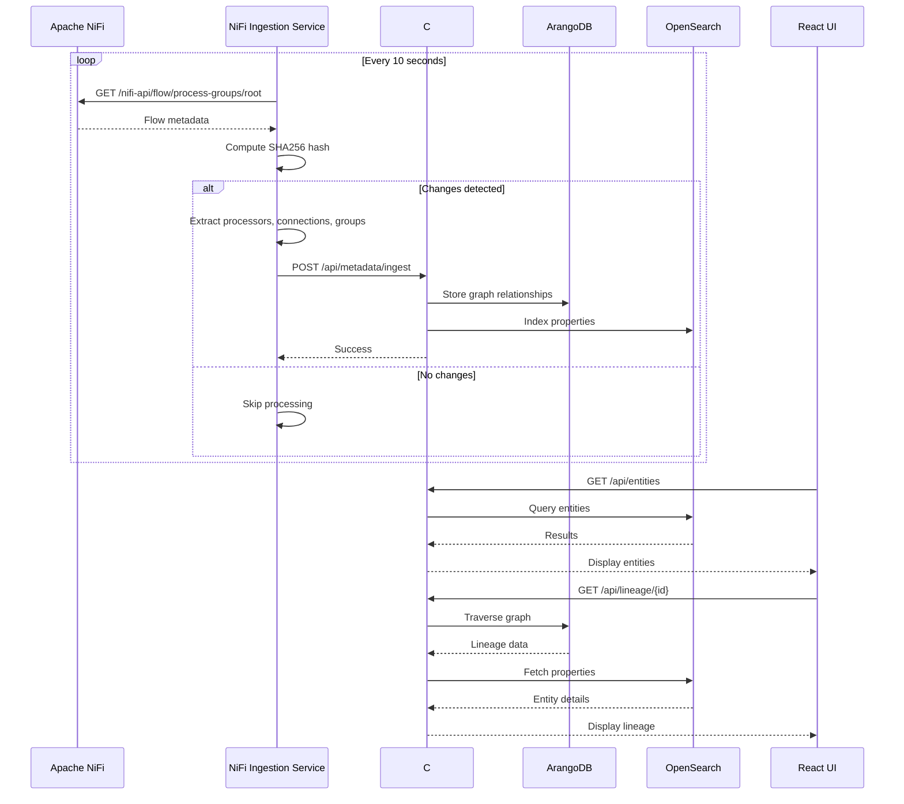
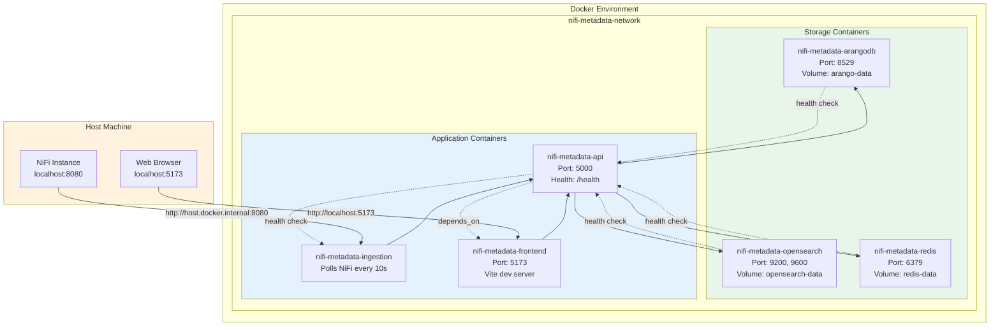
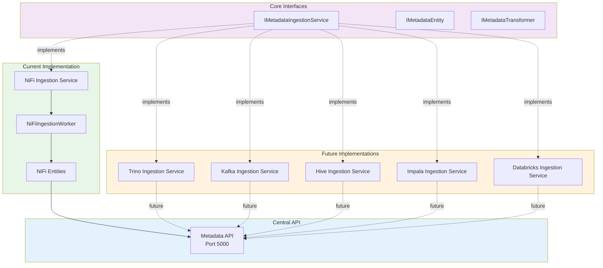
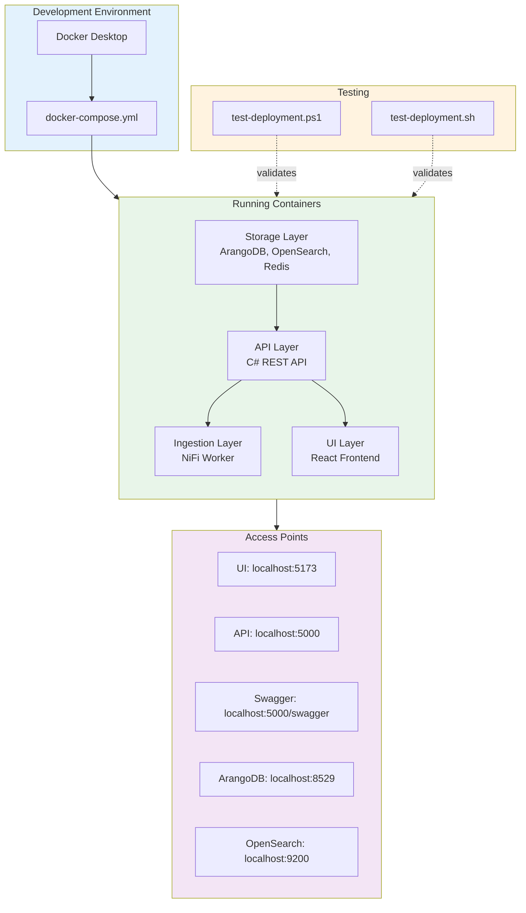
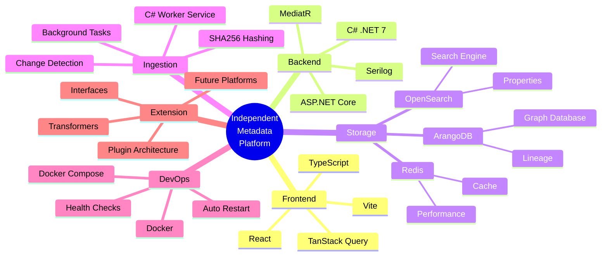
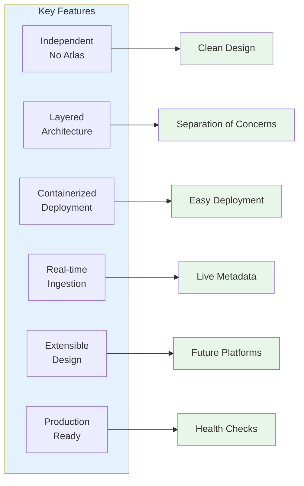

# Architecture Screenshot - Independent Layered Design

This document provides visual representations of the new independent layered architecture.

## System Architecture Overview

## Detailed Component Architecture

## Data Flow - Metadata Ingestion

## Container Architecture

## Extension Architecture for Future Platforms

## Deployment Architecture

## Technology Stack

## Access Points Summary

| Service | URL | Purpose |
|---------|-----|---------|
| **UI** | http://localhost:5173 | React frontend for users |
| **API** | http://localhost:5000 | REST API endpoints |
| **Swagger** | http://localhost:5000/swagger | API documentation |
| **Health** | http://localhost:5000/health | API health check |
| **ArangoDB** | http://localhost:8529 | Graph database UI (root/rootpassword) |
| **OpenSearch** | http://localhost:9200 | Search engine API |

## Key Features Visualization

---

## How to View These Diagrams

These Mermaid diagrams will render automatically in:
- ✅ GitHub
- ✅ GitLab
- ✅ VS Code (with Mermaid extension)
- ✅ Markdown viewers that support Mermaid

## Related Documentation

- **Architecture Details:** `INDEPENDENT-ARCHITECTURE.md`
- **Deployment Guide:** `docker/README-DEPLOYMENT.md`
- **Extension Guide:** `src/Core/NiFiMetadataPlatform.Domain/README-EXTENSIBILITY.md`
- **Implementation Summary:** `IMPLEMENTATION-COMPLETE.md`

---

**Last Updated:** March 2, 2026  
**Status:** ✅ Complete and Production Ready
