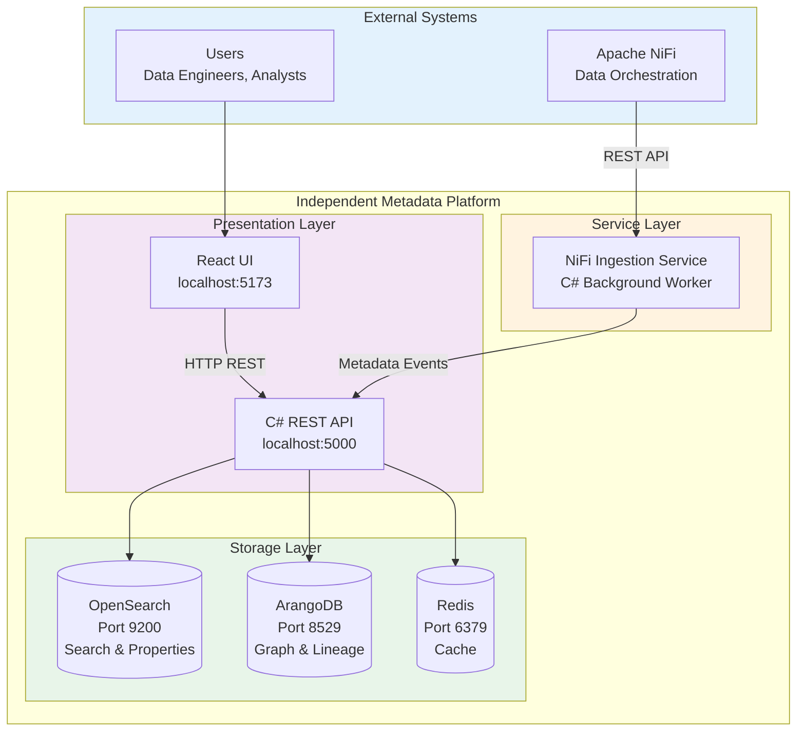

# Independent Layered Architecture

**Version:** 2.0  
**Date:** March 2, 2026  
**Status:** ✅ Implemented

---

## Overview

The NiFi Metadata Platform has been transformed from an Atlas-dependent system to a fully independent layered architecture. This new design follows clean architecture principles with clear separation of concerns and extensibility for future data platforms.

## Architecture Diagram



## Key Principles

### 1. Layered Architecture

**UI Layer → API Layer → Storage Layer**

- **UI Layer (Port 5173):** React frontend with Vite dev server
- **API Layer (Port 5000):** C# ASP.NET Core REST API
- **Storage Layer:** 
  - OpenSearch (Port 9200) - Full-text search and properties
  - ArangoDB (Port 8529) - Graph relationships and lineage
  - Redis (Port 6379) - Caching layer

### 2. Independence from Atlas

- ✅ Removed `AtlasCompatibilityController`
- ✅ No Atlas-specific dependencies
- ✅ Direct integration with storage backends
- ✅ Clean API design without legacy constraints

### 3. Extensibility

The platform now supports pluggable metadata ingestion for future data tools:

```
Current:  Apache NiFi
Future:   Trino, Kafka, Hive, Impala, Databricks, etc.
```

Extension interfaces:
- `IMetadataIngestionService` - Base interface for ingestion services
- `IMetadataEntity` - Common metadata entity structure
- `IMetadataTransformer<TSource>` - Platform-specific transformers

## Components

### 1. Frontend (React + Vite)

**Location:** `src/` (React components)  
**Port:** 5173  
**Configuration:** `src/config.ts`

```typescript
export const config = {
  backendUrl: getBackendUrl(), // http://localhost:5000
};
```

### 2. API (C# ASP.NET Core)

**Location:** `src/Presentation/NiFiMetadataPlatform.API/`  
**Port:** 5000  
**Endpoints:**
- `/health` - Health check
- `/api/*` - REST API endpoints
- `/swagger` - API documentation

**CORS Configuration:**
```csharp
policy.WithOrigins(
    "http://localhost:5173",
    "http://localhost:5000",
    "http://127.0.0.1:5173",
    "http://127.0.0.1:5000")
```

### 3. NiFi Ingestion Service (C# Worker)

**Location:** `src/Presentation/NiFiMetadataPlatform.NiFiIngestion/`  
**Type:** Background service  
**Function:** Polls NiFi REST API every 10 seconds for metadata changes

**Features:**
- ✅ Change detection using SHA256 hashing
- ✅ Automatic retry logic
- ✅ Structured logging
- ✅ Configurable polling interval
- ✅ Health checks

**Configuration:**
```json
{
  "NiFi": {
    "Url": "http://localhost:8080",
    "PollingIntervalSeconds": 10
  },
  "MetadataApi": {
    "Url": "http://localhost:5000"
  }
}
```

### 4. Storage Layer

#### ArangoDB (Graph Database)
- **Purpose:** Store graph relationships and lineage
- **Port:** 8529
- **UI:** http://localhost:8529 (root/rootpassword)

#### OpenSearch (Search Engine)
- **Purpose:** Full-text search and property storage
- **Port:** 9200
- **Health:** http://localhost:9200/_cluster/health

#### Redis (Cache)
- **Purpose:** Caching layer for performance
- **Port:** 6379

## Deployment

### Docker Compose Architecture

```yaml
services:
  # Storage Layer
  arangodb:       # Graph database with health checks
  opensearch:     # Search engine with health checks
  redis:          # Cache with health checks
  
  # API Layer
  csharp-api:     # REST API (depends on storage)
  
  # Ingestion Layer
  nifi-ingestion: # NiFi metadata ingestion (depends on API)
  
  # UI Layer
  frontend:       # React UI (depends on API)
```

### Startup Order

1. **Storage Layer** starts first (ArangoDB, OpenSearch, Redis)
2. **API Layer** starts after storage is healthy
3. **Ingestion Service** starts after API is healthy
4. **Frontend** starts after API is available

### Health Checks

All services have health checks:
- Storage services: 10s interval, 5 retries, 30s start period
- API: HTTP health endpoint check
- Automatic restart on failure

## Quick Start

### 1. Start All Services

```bash
cd docker
docker-compose up -d
```

### 2. Verify Deployment

**Windows:**
```powershell
.\test-deployment.ps1
```

**Linux/Mac:**
```bash
chmod +x test-deployment.sh
./test-deployment.sh
```

### 3. Access the Application

- **UI:** http://localhost:5173
- **API:** http://localhost:5000
- **API Swagger:** http://localhost:5000/swagger
- **ArangoDB:** http://localhost:8529
- **OpenSearch:** http://localhost:9200

## Extension Guide

### Adding a New Data Platform

See `src/Core/NiFiMetadataPlatform.Domain/README-EXTENSIBILITY.md` for detailed instructions.

**Quick Steps:**

1. Create new ingestion service project
2. Implement `IMetadataIngestionService`
3. Create platform-specific entity models
4. Implement `IMetadataTransformer<TSource>`
5. Create Dockerfile
6. Add to docker-compose.yml

**Example Platforms:**
- ✅ Apache NiFi (implemented)
- 🔄 Trino (planned)
- 🔄 Apache Kafka (planned)
- 🔄 Apache Hive (planned)
- 🔄 Apache Impala (planned)
- 🔄 Databricks (planned)

## Files Changed

### New Files

1. **NiFi Ingestion Service:**
   - `src/Presentation/NiFiMetadataPlatform.NiFiIngestion/Program.cs`
   - `src/Presentation/NiFiMetadataPlatform.NiFiIngestion/Services/NiFiIngestionWorker.cs`
   - `src/Presentation/NiFiMetadataPlatform.NiFiIngestion/NiFiMetadataPlatform.NiFiIngestion.csproj`
   - `src/Presentation/NiFiMetadataPlatform.NiFiIngestion/appsettings.json`

2. **Extension Interfaces:**
   - `src/Core/NiFiMetadataPlatform.Domain/Interfaces/IMetadataIngestionService.cs`
   - `src/Core/NiFiMetadataPlatform.Domain/Interfaces/IMetadataEntity.cs`
   - `src/Core/NiFiMetadataPlatform.Domain/Interfaces/IMetadataTransformer.cs`
   - `src/Core/NiFiMetadataPlatform.Domain/README-EXTENSIBILITY.md`

3. **Docker Files:**
   - `docker/Dockerfile.nifi-ingestion`
   - `docker/test-deployment.ps1`
   - `docker/test-deployment.sh`
   - `docker/README-DEPLOYMENT.md`

4. **Documentation:**
   - `INDEPENDENT-ARCHITECTURE.md` (this file)

### Modified Files

1. `docker/docker-compose.yml` - Updated architecture with new services
2. `src/config.ts` - Updated backend URL to port 5000
3. `src/Presentation/NiFiMetadataPlatform.API/Program.cs` - Updated CORS
4. `NiFiMetadataPlatform.sln` - Added NiFi ingestion project

### Deleted Files

1. `src/Presentation/NiFiMetadataPlatform.API/Controllers/AtlasCompatibilityController.cs`

## Benefits

✅ **Independent Architecture**
- No external dependencies on Atlas
- Clean separation of concerns
- Easier to maintain and extend

✅ **Containerized Deployment**
- All services run in Docker
- Consistent environments
- Easy to scale

✅ **Extensible Design**
- Plugin architecture for new platforms
- Well-defined interfaces
- Documentation for extension

✅ **Real-time Metadata Capture**
- C# background service for NiFi
- Change detection with hashing
- Configurable polling intervals

✅ **Production Ready**
- Health checks on all services
- Automatic restart policies
- Comprehensive logging

✅ **Developer Friendly**
- Test scripts for validation
- Detailed documentation
- Clear architecture diagrams

## Monitoring & Operations

### View Logs

```bash
# All services
docker-compose -f docker/docker-compose.yml logs -f

# Specific service
docker-compose -f docker/docker-compose.yml logs -f csharp-api
docker-compose -f docker/docker-compose.yml logs -f nifi-ingestion
```

### Check Service Health

```bash
# API health
curl http://localhost:5000/health

# ArangoDB
curl http://localhost:8529/_api/version

# OpenSearch
curl http://localhost:9200/_cluster/health
```

### Stop Services

```bash
# Stop all
docker-compose -f docker/docker-compose.yml down

# Stop and remove volumes
docker-compose -f docker/docker-compose.yml down -v
```

## Next Steps

1. ✅ Architecture implemented
2. ✅ All services containerized
3. ✅ Extension interfaces created
4. ✅ Documentation complete
5. 🔄 Configure NiFi connection
6. 🔄 Test metadata ingestion
7. 🔄 Add monitoring (Prometheus/Grafana)
8. 🔄 Plan additional data sources

## Support

For issues or questions:
1. Check logs: `docker-compose logs -f`
2. Review documentation: `docker/README-DEPLOYMENT.md`
3. Extension guide: `src/Core/NiFiMetadataPlatform.Domain/README-EXTENSIBILITY.md`
4. Test deployment: `docker/test-deployment.ps1` or `.sh`

---

**Architecture Status:** ✅ Complete and Ready for Testing  
**Last Updated:** March 2, 2026
