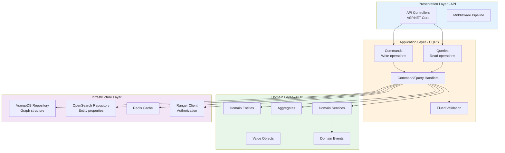

# NiFi Metadata Platform - Enterprise C# Architecture

**Version:** 1.0  
**Date:** February 26, 2026  
**Status:** Architecture Design  
**Technology:** C# .NET 8 with Clean Architecture + DDD + CQRS

---

## Executive Summary

Enterprise-grade metadata management platform for Apache NiFi built with C# .NET 8, following Clean Architecture, Domain-Driven Design (DDD), and Command Query Responsibility Segregation (CQRS) patterns. Designed for production scalability, maintainability, and professional code quality matching Octopai standards.

### Key Features
- Real-time metadata capture from NiFi
- Split storage: ArangoDB (graph) + OpenSearch (properties)
- Clean Architecture with strict boundary enforcement
- CQRS for read/write separation
- Apache Ranger integration for authorization
- Kubernetes-native deployment
- Comprehensive testing (unit, integration, performance)
- Production-ready monitoring and observability

---

## Architecture Overview



---

## Clean Architecture Layers

### Layer 1: Domain Layer (Core Business Logic)

**No external dependencies - Pure C# business logic**

```csharp
// Domain/Entities/NiFiProcessor.cs
namespace NiFiMetadataPlatform.Domain.Entities
{
    /// <summary>
    /// Represents a NiFi processor entity with rich domain behavior
    /// </summary>
    public sealed class NiFiProcessor : Entity<ProcessorId>, IAggregateRoot
    {
        private readonly List<DomainEvent> _domainEvents = new();
        
        public ProcessorFqn Fqn { get; private set; }
        public ProcessorName Name { get; private set; }
        public ProcessorType Type { get; private set; }
        public ProcessorStatus Status { get; private set; }
        public ProcessorProperties Properties { get; private set; }
        public ProcessGroupId ParentProcessGroupId { get; private set; }
        
        // Relationships (stored in graph)
        private readonly List<ProcessorConnection> _connections = new();
        public IReadOnlyCollection<ProcessorConnection> Connections => _connections.AsReadOnly();
        
        // Metadata (stored in search)
        public string? Description { get; private set; }
        public Owner? Owner { get; private set; }
        public IReadOnlyCollection<Tag> Tags { get; private set; }
        public DateTime CreatedAt { get; private set; }
        public DateTime UpdatedAt { get; private set; }
        
        private NiFiProcessor() { } // For EF/serialization
        
        public static NiFiProcessor Create(
            ProcessorFqn fqn,
            ProcessorName name,
            ProcessorType type,
            ProcessGroupId parentProcessGroupId)
        {
            var processor = new NiFiProcessor
            {
                Id = ProcessorId.CreateNew(),
                Fqn = fqn,
                Name = name,
                Type = type,
                Status = ProcessorStatus.Active,
                ParentProcessGroupId = parentProcessGroupId,
                CreatedAt = DateTime.UtcNow,
                UpdatedAt = DateTime.UtcNow
            };
            
            processor.AddDomainEvent(new ProcessorCreatedEvent(processor.Id, processor.Fqn));
            return processor;
        }
        
        public void UpdateProperties(ProcessorProperties properties)
        {
            Properties = properties ?? throw new ArgumentNullException(nameof(properties));
            UpdatedAt = DateTime.UtcNow;
            
            AddDomainEvent(new ProcessorPropertiesUpdatedEvent(Id, Fqn, properties));
        }
        
        public void AddConnection(ProcessorConnection connection)
        {
            if (connection == null) throw new ArgumentNullException(nameof(connection));
            
            _connections.Add(connection);
            AddDomainEvent(new ProcessorConnectionAddedEvent(Id, connection.TargetProcessorId));
        }
        
        public void Deactivate()
        {
            if (Status == ProcessorStatus.Deleted)
                throw new InvalidOperationException("Cannot deactivate deleted processor");
            
            Status = ProcessorStatus.Inactive;
            UpdatedAt = DateTime.UtcNow;
            
            AddDomainEvent(new ProcessorDeactivatedEvent(Id, Fqn));
        }
        
        private void AddDomainEvent(DomainEvent domainEvent)
        {
            _domainEvents.Add(domainEvent);
        }
        
        public IReadOnlyCollection<DomainEvent> GetDomainEvents() => _domainEvents.AsReadOnly();
        
        public void ClearDomainEvents() => _domainEvents.Clear();
    }
}
```

**Value Objects:**

```csharp
// Domain/ValueObjects/ProcessorFqn.cs
namespace NiFiMetadataPlatform.Domain.ValueObjects
{
    /// <summary>
    /// Fully Qualified Name - Immutable value object
    /// </summary>
    public sealed record ProcessorFqn
    {
        private const string Prefix = "nifi://";
        
        public string Value { get; }
        
        private ProcessorFqn(string value)
        {
            Value = value;
        }
        
        public static ProcessorFqn Create(string containerId, string processGroupId, string processorId)
        {
            if (string.IsNullOrWhiteSpace(containerId))
                throw new ArgumentException("Container ID cannot be empty", nameof(containerId));
            
            if (string.IsNullOrWhiteSpace(processorId))
                throw new ArgumentException("Processor ID cannot be empty", nameof(processorId));
            
            var fqn = $"{Prefix}container/{containerId}/processor/{processorId}";
            return new ProcessorFqn(fqn);
        }
        
        public static ProcessorFqn Parse(string fqn)
        {
            if (string.IsNullOrWhiteSpace(fqn))
                throw new ArgumentException("FQN cannot be empty", nameof(fqn));
            
            if (!fqn.StartsWith(Prefix))
                throw new ArgumentException($"FQN must start with {Prefix}", nameof(fqn));
            
            return new ProcessorFqn(fqn);
        }
        
        public override string ToString() => Value;
    }
}
```

**Domain Events:**

```csharp
// Domain/Events/ProcessorCreatedEvent.cs
namespace NiFiMetadataPlatform.Domain.Events
{
    public sealed record ProcessorCreatedEvent(
        ProcessorId ProcessorId,
        ProcessorFqn Fqn,
        DateTime OccurredAt) : DomainEvent(OccurredAt)
    {
        public ProcessorCreatedEvent(ProcessorId processorId, ProcessorFqn fqn)
            : this(processorId, fqn, DateTime.UtcNow)
        {
        }
    }
}
```

### Layer 2: Application Layer (Use Cases)

**CQRS Implementation with MediatR**

```csharp
// Application/Commands/CreateProcessor/CreateProcessorCommand.cs
namespace NiFiMetadataPlatform.Application.Commands.CreateProcessor
{
    public sealed record CreateProcessorCommand(
        string ContainerId,
        string ProcessGroupId,
        string ProcessorId,
        string Name,
        string Type,
        Dictionary<string, string> Properties) : ICommand<ProcessorDto>;
}

// Application/Commands/CreateProcessor/CreateProcessorCommandHandler.cs
namespace NiFiMetadataPlatform.Application.Commands.CreateProcessor
{
    public sealed class CreateProcessorCommandHandler 
        : ICommandHandler<CreateProcessorCommand, ProcessorDto>
    {
        private readonly IGraphRepository _graphRepository;
        private readonly ISearchRepository _searchRepository;
        private readonly IUnitOfWork _unitOfWork;
        private readonly ILogger<CreateProcessorCommandHandler> _logger;
        
        public CreateProcessorCommandHandler(
            IGraphRepository graphRepository,
            ISearchRepository searchRepository,
            IUnitOfWork unitOfWork,
            ILogger<CreateProcessorCommandHandler> logger)
        {
            _graphRepository = graphRepository;
            _searchRepository = searchRepository;
            _unitOfWork = unitOfWork;
            _logger = logger;
        }
        
        public async Task<Result<ProcessorDto>> Handle(
            CreateProcessorCommand command,
            CancellationToken cancellationToken)
        {
            try
            {
                // 1. Create domain entity
                var fqn = ProcessorFqn.Create(
                    command.ContainerId,
                    command.ProcessGroupId,
                    command.ProcessorId);
                
                var name = ProcessorName.Create(command.Name);
                var type = ProcessorType.Parse(command.Type);
                var parentId = ProcessGroupId.Parse(command.ProcessGroupId);
                
                var processor = NiFiProcessor.Create(fqn, name, type, parentId);
                
                // 2. Set properties
                var properties = ProcessorProperties.Create(command.Properties);
                processor.UpdateProperties(properties);
                
                // 3. Begin transaction
                await _unitOfWork.BeginTransactionAsync(cancellationToken);
                
                // 4. Dual write: Graph + Search
                await _graphRepository.AddVertexAsync(processor, cancellationToken);
                await _searchRepository.IndexEntityAsync(processor, cancellationToken);
                
                // 5. Commit transaction
                await _unitOfWork.CommitAsync(cancellationToken);
                
                // 6. Publish domain events
                await PublishDomainEventsAsync(processor, cancellationToken);
                
                _logger.LogInformation(
                    "Created processor {ProcessorFqn} successfully",
                    processor.Fqn);
                
                return Result.Success(ProcessorDto.FromEntity(processor));
            }
            catch (Exception ex)
            {
                _logger.LogError(ex, "Failed to create processor");
                await _unitOfWork.RollbackAsync(cancellationToken);
                return Result.Failure<ProcessorDto>(ex.Message);
            }
        }
        
        private async Task PublishDomainEventsAsync(
            NiFiProcessor processor,
            CancellationToken cancellationToken)
        {
            foreach (var domainEvent in processor.GetDomainEvents())
            {
                await _mediator.Publish(domainEvent, cancellationToken);
            }
            
            processor.ClearDomainEvents();
        }
    }
}
```

**Query Implementation:**

```csharp
// Application/Queries/GetLineage/GetLineageQuery.cs
namespace NiFiMetadataPlatform.Application.Queries.GetLineage
{
    public sealed record GetLineageQuery(
        string Fqn,
        int Depth,
        LineageDirection Direction) : IQuery<LineageGraphDto>;
}

// Application/Queries/GetLineage/GetLineageQueryHandler.cs
namespace NiFiMetadataPlatform.Application.Queries.GetLineage
{
    public sealed class GetLineageQueryHandler 
        : IQueryHandler<GetLineageQuery, LineageGraphDto>
    {
        private readonly IGraphRepository _graphRepository;
        private readonly ISearchRepository _searchRepository;
        private readonly ICacheService _cacheService;
        private readonly ILogger<GetLineageQueryHandler> _logger;
        
        public GetLineageQueryHandler(
            IGraphRepository graphRepository,
            ISearchRepository searchRepository,
            ICacheService cacheService,
            ILogger<GetLineageQueryHandler> logger)
        {
            _graphRepository = graphRepository;
            _searchRepository = searchRepository;
            _cacheService = cacheService;
            _logger = logger;
        }
        
        public async Task<Result<LineageGraphDto>> Handle(
            GetLineageQuery query,
            CancellationToken cancellationToken)
        {
            var stopwatch = Stopwatch.StartNew();
            
            try
            {
                // 1. Check cache
                var cacheKey = $"lineage:{query.Fqn}:{query.Depth}:{query.Direction}";
                var cached = await _cacheService.GetAsync<LineageGraphDto>(
                    cacheKey,
                    cancellationToken);
                
                if (cached != null)
                {
                    _logger.LogDebug("Cache hit for lineage query: {CacheKey}", cacheKey);
                    return Result.Success(cached);
                }
                
                // 2. Traverse graph in ArangoDB (get FQNs only)
                var fqns = await _graphRepository.TraverseLineageAsync(
                    query.Fqn,
                    query.Depth,
                    query.Direction,
                    cancellationToken);
                
                _logger.LogDebug(
                    "Graph traversal found {Count} entities in {ElapsedMs}ms",
                    fqns.Count,
                    stopwatch.ElapsedMilliseconds);
                
                // 3. Bulk fetch complete entities from OpenSearch
                var entities = await _searchRepository.BulkGetAsync(
                    fqns,
                    cancellationToken);
                
                _logger.LogDebug(
                    "Bulk fetch completed in {ElapsedMs}ms",
                    stopwatch.ElapsedMilliseconds);
                
                // 4. Build lineage graph
                var graph = LineageGraphBuilder.Build(entities, fqns);
                var dto = LineageGraphDto.FromDomain(graph);
                
                // 5. Cache result
                await _cacheService.SetAsync(
                    cacheKey,
                    dto,
                    TimeSpan.FromMinutes(5),
                    cancellationToken);
                
                _logger.LogInformation(
                    "Lineage query completed in {ElapsedMs}ms for {Fqn}",
                    stopwatch.ElapsedMilliseconds,
                    query.Fqn);
                
                return Result.Success(dto);
            }
            catch (Exception ex)
            {
                _logger.LogError(ex, "Failed to get lineage for {Fqn}", query.Fqn);
                return Result.Failure<LineageGraphDto>(ex.Message);
            }
        }
    }
}
```

---

## Project Structure (Clean Architecture)

```
NiFiMetadataPlatform/
├── src/
│   ├── NiFiMetadataPlatform.Domain/
│   │   ├── Entities/
│   │   │   ├── NiFiProcessor.cs
│   │   │   ├── NiFiProcessGroup.cs
│   │   │   ├── NiFiConnection.cs
│   │   │   └── Entity.cs (base)
│   │   ├── ValueObjects/
│   │   │   ├── ProcessorFqn.cs
│   │   │   ├── ProcessorId.cs
│   │   │   ├── ProcessorName.cs
│   │   │   └── ProcessorProperties.cs
│   │   ├── Aggregates/
│   │   │   └── NiFiFlowAggregate.cs
│   │   ├── Events/
│   │   │   ├── ProcessorCreatedEvent.cs
│   │   │   ├── ProcessorUpdatedEvent.cs
│   │   │   └── DomainEvent.cs (base)
│   │   ├── Services/
│   │   │   ├── ILineageCalculator.cs
│   │   │   └── LineageCalculator.cs
│   │   ├── Exceptions/
│   │   │   ├── ProcessorNotFoundException.cs
│   │   │   └── DomainException.cs
│   │   └── Common/
│   │       ├── Result.cs
│   │       └── Error.cs
│   │
│   ├── NiFiMetadataPlatform.Application/
│   │   ├── Commands/
│   │   │   ├── CreateProcessor/
│   │   │   │   ├── CreateProcessorCommand.cs
│   │   │   │   ├── CreateProcessorCommandHandler.cs
│   │   │   │   └── CreateProcessorCommandValidator.cs
│   │   │   ├── UpdateProcessor/
│   │   │   ├── DeleteProcessor/
│   │   │   └── CreateLineage/
│   │   ├── Queries/
│   │   │   ├── GetProcessor/
│   │   │   │   ├── GetProcessorQuery.cs
│   │   │   │   └── GetProcessorQueryHandler.cs
│   │   │   ├── GetLineage/
│   │   │   ├── SearchEntities/
│   │   │   └── GetHierarchy/
│   │   ├── DTOs/
│   │   │   ├── ProcessorDto.cs
│   │   │   ├── LineageGraphDto.cs
│   │   │   └── SearchResultDto.cs
│   │   ├── Interfaces/
│   │   │   ├── IGraphRepository.cs
│   │   │   ├── ISearchRepository.cs
│   │   │   ├── ICacheService.cs
│   │   │   └── IUnitOfWork.cs
│   │   ├── Behaviors/
│   │   │   ├── ValidationBehavior.cs
│   │   │   ├── LoggingBehavior.cs
│   │   │   ├── TransactionBehavior.cs
│   │   │   └── PerformanceBehavior.cs
│   │   └── Services/
│   │       ├── IAuthorizationService.cs
│   │       └── IConsistencyService.cs
│   │
│   ├── NiFiMetadataPlatform.Infrastructure/
│   │   ├── Persistence/
│   │   │   ├── ArangoDB/
│   │   │   │   ├── ArangoDbContext.cs
│   │   │   │   ├── ArangoGraphRepository.cs
│   │   │   │   ├── ArangoConfiguration.cs
│   │   │   │   └── ArangoHealthCheck.cs
│   │   │   ├── OpenSearch/
│   │   │   │   ├── OpenSearchContext.cs
│   │   │   │   ├── OpenSearchRepository.cs
│   │   │   │   ├── OpenSearchConfiguration.cs
│   │   │   │   └── OpenSearchHealthCheck.cs
│   │   │   └── UnitOfWork.cs
│   │   ├── Caching/
│   │   │   ├── RedisCacheService.cs
│   │   │   ├── MemoryCacheService.cs
│   │   │   └── HybridCacheService.cs
│   │   ├── Security/
│   │   │   ├── RangerClient.cs
│   │   │   ├── RangerAuthorizationService.cs
│   │   │   └── PolicyCache.cs
│   │   ├── Ingestion/
│   │   │   ├── NiFiApiClient.cs
│   │   │   ├── ChangeDetector.cs
│   │   │   ├── MetadataParser.cs
│   │   │   └── SqlLineageParser.cs
│   │   └── Monitoring/
│   │       ├── PrometheusMetrics.cs
│   │       └── HealthCheckService.cs
│   │
│   ├── NiFiMetadataPlatform.API/
│   │   ├── Controllers/
│   │   │   ├── EntitiesController.cs
│   │   │   ├── LineageController.cs
│   │   │   ├── SearchController.cs
│   │   │   └── HealthController.cs
│   │   ├── Middleware/
│   │   │   ├── AuthenticationMiddleware.cs
│   │   │   ├── AuthorizationMiddleware.cs
│   │   │   ├── ExceptionHandlingMiddleware.cs
│   │   │   └── RequestLoggingMiddleware.cs
│   │   ├── Filters/
│   │   │   ├── ValidateModelAttribute.cs
│   │   │   └── RangerAuthorizationAttribute.cs
│   │   ├── Program.cs
│   │   ├── Startup.cs
│   │   └── appsettings.json
│   │
│   ├── NiFiMetadataPlatform.Worker/
│   │   ├── Services/
│   │   │   ├── NiFiMonitorService.cs
│   │   │   ├── ChangeProcessorService.cs
│   │   │   └── ReconciliationService.cs
│   │   ├── BackgroundServices/
│   │   │   ├── MonitorBackgroundService.cs
│   │   │   └── ReconciliationBackgroundService.cs
│   │   └── Program.cs
│   │
│   └── NiFiMetadataPlatform.Contracts/
│       ├── Requests/
│       │   ├── CreateProcessorRequest.cs
│       │   └── SearchRequest.cs
│       └── Responses/
│           ├── ProcessorResponse.cs
│           └── LineageGraphResponse.cs
│
├── tests/
│   ├── NiFiMetadataPlatform.Domain.Tests/
│   │   ├── Entities/
│   │   │   └── NiFiProcessorTests.cs
│   │   └── ValueObjects/
│   │       └── ProcessorFqnTests.cs
│   │
│   ├── NiFiMetadataPlatform.Application.Tests/
│   │   ├── Commands/
│   │   │   └── CreateProcessorCommandHandlerTests.cs
│   │   └── Queries/
│   │       └── GetLineageQueryHandlerTests.cs
│   │
│   ├── NiFiMetadataPlatform.Integration.Tests/
│   │   ├── Api/
│   │   │   └── EntitiesControllerTests.cs
│   │   └── Ingestion/
│   │       └── NiFiIngestionFlowTests.cs
│   │
│   ├── NiFiMetadataPlatform.Performance.Tests/
│   │   └── LineagePerformanceTests.cs
│   │
│   └── NiFiMetadataPlatform.ArchitectureTests/
│       └── ArchitectureTests.cs (NetArchTest)
│
├── k8s/
│   ├── base/
│   │   ├── api-deployment.yaml
│   │   ├── worker-deployment.yaml
│   │   ├── arangodb-statefulset.yaml
│   │   ├── opensearch-statefulset.yaml
│   │   └── redis-statefulset.yaml
│   └── overlays/
│       ├── dev/
│       ├── staging/
│       └── production/
│
├── docs/
│   ├── ARCHITECTURE.md
│   ├── API-SPECIFICATION.md
│   └── DEPLOYMENT-GUIDE.md
│
├── NiFiMetadataPlatform.sln
└── Directory.Build.props
```

---

## Split Storage Implementation

### ArangoDB Repository (Graph Structure)

```csharp
// Infrastructure/Persistence/ArangoDB/ArangoGraphRepository.cs
namespace NiFiMetadataPlatform.Infrastructure.Persistence.ArangoDB
{
    public sealed class ArangoGraphRepository : IGraphRepository
    {
        private readonly IArangoDatabase _database;
        private readonly ILogger<ArangoGraphRepository> _logger;
        private const string EntitiesCollection = "entities";
        private const string RelationshipsCollection = "relationships";
        
        public ArangoGraphRepository(
            IArangoDatabase database,
            ILogger<ArangoGraphRepository> logger)
        {
            _database = database;
            _logger = logger;
        }
        
        public async Task<Result> AddVertexAsync(
            NiFiProcessor processor,
            CancellationToken cancellationToken)
        {
            try
            {
                // Store only minimal properties in graph
                var vertex = new GraphVertex
                {
                    Key = processor.Id.Value.ToString(),
                    Fqn = processor.Fqn.Value,
                    Type = processor.Type.Value,
                    Status = processor.Status.ToString(),
                    Platform = "nifi"
                };
                
                var collection = _database.Collection<GraphVertex>(EntitiesCollection);
                await collection.InsertAsync(vertex, cancellationToken: cancellationToken);
                
                _logger.LogDebug(
                    "Inserted vertex to ArangoDB: {Fqn}",
                    processor.Fqn);
                
                return Result.Success();
            }
            catch (Exception ex)
            {
                _logger.LogError(ex, "Failed to insert vertex: {Fqn}", processor.Fqn);
                return Result.Failure(ex.Message);
            }
        }
        
        public async Task<Result<List<string>>> TraverseLineageAsync(
            string fqn,
            int depth,
            LineageDirection direction,
            CancellationToken cancellationToken)
        {
            try
            {
                var directionStr = direction switch
                {
                    LineageDirection.Upstream => "INBOUND",
                    LineageDirection.Downstream => "OUTBOUND",
                    LineageDirection.Both => "ANY",
                    _ => throw new ArgumentException("Invalid direction")
                };
                
                // AQL query for graph traversal
                var aql = $@"
                    FOR v, e, p IN 1..@depth {directionStr} @start {RelationshipsCollection}
                        OPTIONS {{bfs: true, uniqueVertices: 'global'}}
                        FILTER v.status == 'Active'
                        RETURN DISTINCT v.fqn
                ";
                
                var bindVars = new Dictionary<string, object>
                {
                    { "start", $"{EntitiesCollection}/{GetKeyFromFqn(fqn)}" },
                    { "depth", depth }
                };
                
                var cursor = await _database.QueryAsync<string>(
                    aql,
                    bindVars,
                    cancellationToken: cancellationToken);
                
                var fqns = await cursor.ToListAsync(cancellationToken);
                
                _logger.LogDebug(
                    "Traversed {Count} entities in {Direction} direction, depth {Depth}",
                    fqns.Count,
                    direction,
                    depth);
                
                return Result.Success(fqns);
            }
            catch (Exception ex)
            {
                _logger.LogError(ex, "Failed to traverse lineage for {Fqn}", fqn);
                return Result.Failure<List<string>>(ex.Message);
            }
        }
        
        public async Task<Result> AddEdgeAsync(
            string fromFqn,
            string toFqn,
            RelationshipType relationshipType,
            CancellationToken cancellationToken)
        {
            try
            {
                var edge = new GraphEdge
                {
                    From = $"{EntitiesCollection}/{GetKeyFromFqn(fromFqn)}",
                    To = $"{EntitiesCollection}/{GetKeyFromFqn(toFqn)}",
                    RelationshipType = relationshipType.ToString(),
                    CreatedAt = DateTime.UtcNow
                };
                
                var collection = _database.Collection<GraphEdge>(RelationshipsCollection);
                await collection.InsertAsync(edge, cancellationToken: cancellationToken);
                
                _logger.LogDebug(
                    "Created edge: {From} -> {To} ({Type})",
                    fromFqn,
                    toFqn,
                    relationshipType);
                
                return Result.Success();
            }
            catch (Exception ex)
            {
                _logger.LogError(ex, "Failed to create edge");
                return Result.Failure(ex.Message);
            }
        }
        
        private static string GetKeyFromFqn(string fqn)
        {
            // Convert FQN to ArangoDB key
            return fqn.Replace("://", "-").Replace("/", "-");
        }
    }
    
    // Graph vertex model (lightweight)
    internal sealed class GraphVertex
    {
        [JsonProperty("_key")]
        public string Key { get; set; } = string.Empty;
        
        [JsonProperty("fqn")]
        public string Fqn { get; set; } = string.Empty;
        
        [JsonProperty("type")]
        public string Type { get; set; } = string.Empty;
        
        [JsonProperty("status")]
        public string Status { get; set; } = string.Empty;
        
        [JsonProperty("platform")]
        public string Platform { get; set; } = string.Empty;
    }
    
    // Graph edge model
    internal sealed class GraphEdge
    {
        [JsonProperty("_from")]
        public string From { get; set; } = string.Empty;
        
        [JsonProperty("_to")]
        public string To { get; set; } = string.Empty;
        
        [JsonProperty("relationshipType")]
        public string RelationshipType { get; set; } = string.Empty;
        
        [JsonProperty("createdAt")]
        public DateTime CreatedAt { get; set; }
    }
}
```

### OpenSearch Repository (Complete Properties)

```csharp
// Infrastructure/Persistence/OpenSearch/OpenSearchRepository.cs
namespace NiFiMetadataPlatform.Infrastructure.Persistence.OpenSearch
{
    public sealed class OpenSearchRepository : ISearchRepository
    {
        private readonly IOpenSearchClient _client;
        private readonly ILogger<OpenSearchRepository> _logger;
        private const string EntitiesIndex = "nifi_entities";
        
        public OpenSearchRepository(
            IOpenSearchClient client,
            ILogger<OpenSearchRepository> logger)
        {
            _client = client;
            _logger = logger;
        }
        
        public async Task<Result> IndexEntityAsync(
            NiFiProcessor processor,
            CancellationToken cancellationToken)
        {
            try
            {
                // Store complete entity with all properties
                var document = new ProcessorDocument
                {
                    Fqn = processor.Fqn.Value,
                    Guid = processor.Id.Value.ToString(),
                    Type = processor.Type.Value,
                    Status = processor.Status.ToString(),
                    Platform = "nifi",
                    
                    // Complete metadata
                    Name = processor.Name.Value,
                    Description = processor.Description,
                    ProcessorType = processor.Type.Value,
                    Properties = processor.Properties.ToDictionary(),
                    
                    // Ownership
                    Owner = processor.Owner?.Value,
                    Tags = processor.Tags.Select(t => t.Value).ToList(),
                    
                    // Timestamps
                    CreatedAt = processor.CreatedAt,
                    UpdatedAt = processor.UpdatedAt,
                    
                    // Hierarchy
                    ParentProcessGroupFqn = processor.ParentProcessGroupId.ToString()
                };
                
                var response = await _client.IndexAsync(
                    document,
                    idx => idx.Index(EntitiesIndex).Id(processor.Fqn.Value),
                    cancellationToken);
                
                if (!response.IsValid)
                {
                    _logger.LogError(
                        "Failed to index entity: {Error}",
                        response.DebugInformation);
                    return Result.Failure(response.DebugInformation);
                }
                
                _logger.LogDebug("Indexed entity to OpenSearch: {Fqn}", processor.Fqn);
                return Result.Success();
            }
            catch (Exception ex)
            {
                _logger.LogError(ex, "Failed to index entity: {Fqn}", processor.Fqn);
                return Result.Failure(ex.Message);
            }
        }
        
        public async Task<Result<List<NiFiProcessor>>> BulkGetAsync(
            List<string> fqns,
            CancellationToken cancellationToken)
        {
            try
            {
                var stopwatch = Stopwatch.StartNew();
                
                // Bulk fetch using MultiGet
                var response = await _client.MultiGetAsync(
                    m => m.Index(EntitiesIndex)
                          .GetMany<ProcessorDocument>(fqns),
                    cancellationToken);
                
                if (!response.IsValid)
                {
                    _logger.LogError(
                        "Bulk get failed: {Error}",
                        response.DebugInformation);
                    return Result.Failure<List<NiFiProcessor>>(response.DebugInformation);
                }
                
                var processors = response.Hits
                    .Where(h => h.Found)
                    .Select(h => h.Source.ToDomainEntity())
                    .ToList();
                
                _logger.LogDebug(
                    "Bulk fetched {Count} entities in {ElapsedMs}ms",
                    processors.Count,
                    stopwatch.ElapsedMilliseconds);
                
                return Result.Success(processors);
            }
            catch (Exception ex)
            {
                _logger.LogError(ex, "Failed to bulk fetch entities");
                return Result.Failure<List<NiFiProcessor>>(ex.Message);
            }
        }
        
        public async Task<Result<SearchResults>> SearchAsync(
            string query,
            SearchFilters filters,
            CancellationToken cancellationToken)
        {
            try
            {
                var searchResponse = await _client.SearchAsync<ProcessorDocument>(
                    s => s.Index(EntitiesIndex)
                          .Query(q => q
                              .Bool(b => b
                                  .Must(m => m
                                      .MultiMatch(mm => mm
                                          .Query(query)
                                          .Fields(f => f
                                              .Field(p => p.Name, boost: 2.0)
                                              .Field(p => p.Description))))
                                  .Filter(BuildFilters(filters))))
                          .Size(filters.Limit)
                          .From(filters.Offset)
                          .Highlight(h => h
                              .Fields(f => f
                                  .Field(p => p.Name)
                                  .Field(p => p.Description))),
                    cancellationToken);
                
                if (!searchResponse.IsValid)
                {
                    return Result.Failure<SearchResults>(searchResponse.DebugInformation);
                }
                
                var results = new SearchResults
                {
                    Total = searchResponse.Total,
                    Hits = searchResponse.Hits.Select(h => new SearchHit
                    {
                        Entity = h.Source.ToDomainEntity(),
                        Score = h.Score ?? 0,
                        Highlights = h.Highlight
                    }).ToList()
                };
                
                return Result.Success(results);
            }
            catch (Exception ex)
            {
                _logger.LogError(ex, "Search failed for query: {Query}", query);
                return Result.Failure<SearchResults>(ex.Message);
            }
        }
        
        private static QueryContainer[] BuildFilters(SearchFilters filters)
        {
            var filterList = new List<QueryContainer>();
            
            if (!string.IsNullOrEmpty(filters.Type))
                filterList.Add(new TermQuery { Field = "type", Value = filters.Type });
            
            if (!string.IsNullOrEmpty(filters.Platform))
                filterList.Add(new TermQuery { Field = "platform", Value = filters.Platform });
            
            if (filters.Tags?.Any() == true)
                filterList.Add(new TermsQuery { Field = "tags", Terms = filters.Tags });
            
            return filterList.ToArray();
        }
    }
    
    // Complete document model for OpenSearch
    internal sealed class ProcessorDocument
    {
        public string Fqn { get; set; } = string.Empty;
        public string Guid { get; set; } = string.Empty;
        public string Type { get; set; } = string.Empty;
        public string Status { get; set; } = string.Empty;
        public string Platform { get; set; } = string.Empty;
        
        public string Name { get; set; } = string.Empty;
        public string? Description { get; set; }
        public string ProcessorType { get; set; } = string.Empty;
        public Dictionary<string, string> Properties { get; set; } = new();
        
        public string? Owner { get; set; }
        public List<string> Tags { get; set; } = new();
        
        public DateTime CreatedAt { get; set; }
        public DateTime UpdatedAt { get; set; }
        
        public string ParentProcessGroupFqn { get; set; } = string.Empty;
        
        public NiFiProcessor ToDomainEntity()
        {
            // Map back to domain entity
            // Implementation details...
            throw new NotImplementedException();
        }
    }
}
```

---

## API Layer (ASP.NET Core)

### Controller Implementation

```csharp
// API/Controllers/EntitiesController.cs
namespace NiFiMetadataPlatform.API.Controllers
{
    [ApiController]
    [Route("api/v1/[controller]")]
    [Produces("application/json")]
    public sealed class EntitiesController : ControllerBase
    {
        private readonly IMediator _mediator;
        private readonly ILogger<EntitiesController> _logger;
        
        public EntitiesController(
            IMediator mediator,
            ILogger<EntitiesController> logger)
        {
            _mediator = mediator;
            _logger = logger;
        }
        
        /// <summary>
        /// Creates a new NiFi processor entity
        /// </summary>
        /// <param name="request">Processor creation request</param>
        /// <param name="cancellationToken">Cancellation token</param>
        /// <returns>Created processor</returns>
        [HttpPost]
        [ProducesResponseType(typeof(ProcessorResponse), StatusCodes.Status201Created)]
        [ProducesResponseType(typeof(ErrorResponse), StatusCodes.Status400BadRequest)]
        [ProducesResponseType(typeof(ErrorResponse), StatusCodes.Status403Forbidden)]
        [RangerAuthorization(Resource = "entity", Action = "create")]
        public async Task<IActionResult> CreateProcessor(
            [FromBody] CreateProcessorRequest request,
            CancellationToken cancellationToken)
        {
            var command = new CreateProcessorCommand(
                request.ContainerId,
                request.ProcessGroupId,
                request.ProcessorId,
                request.Name,
                request.Type,
                request.Properties);
            
            var result = await _mediator.Send(command, cancellationToken);
            
            return result.Match(
                onSuccess: dto => CreatedAtAction(
                    nameof(GetProcessor),
                    new { fqn = dto.Fqn },
                    ProcessorResponse.FromDto(dto)),
                onFailure: error => BadRequest(new ErrorResponse(error))
            );
        }
        
        /// <summary>
        /// Gets a processor by FQN
        /// </summary>
        /// <param name="fqn">Fully qualified name</param>
        /// <param name="cancellationToken">Cancellation token</param>
        /// <returns>Processor details</returns>
        [HttpGet("{fqn}")]
        [ProducesResponseType(typeof(ProcessorResponse), StatusCodes.Status200OK)]
        [ProducesResponseType(typeof(ErrorResponse), StatusCodes.Status404NotFound)]
        [RangerAuthorization(Resource = "entity", Action = "read")]
        public async Task<IActionResult> GetProcessor(
            string fqn,
            CancellationToken cancellationToken)
        {
            var query = new GetProcessorQuery(fqn);
            var result = await _mediator.Send(query, cancellationToken);
            
            return result.Match(
                onSuccess: dto => Ok(ProcessorResponse.FromDto(dto)),
                onFailure: error => NotFound(new ErrorResponse(error))
            );
        }
        
        /// <summary>
        /// Updates a processor
        /// </summary>
        [HttpPut("{fqn}")]
        [ProducesResponseType(typeof(ProcessorResponse), StatusCodes.Status200OK)]
        [ProducesResponseType(typeof(ErrorResponse), StatusCodes.Status404NotFound)]
        [RangerAuthorization(Resource = "entity", Action = "write")]
        public async Task<IActionResult> UpdateProcessor(
            string fqn,
            [FromBody] UpdateProcessorRequest request,
            CancellationToken cancellationToken)
        {
            var command = new UpdateProcessorCommand(fqn, request.Properties);
            var result = await _mediator.Send(command, cancellationToken);
            
            return result.Match(
                onSuccess: dto => Ok(ProcessorResponse.FromDto(dto)),
                onFailure: error => NotFound(new ErrorResponse(error))
            );
        }
        
        /// <summary>
        /// Deletes a processor
        /// </summary>
        [HttpDelete("{fqn}")]
        [ProducesResponseType(StatusCodes.Status204NoContent)]
        [ProducesResponseType(typeof(ErrorResponse), StatusCodes.Status404NotFound)]
        [RangerAuthorization(Resource = "entity", Action = "delete")]
        public async Task<IActionResult> DeleteProcessor(
            string fqn,
            CancellationToken cancellationToken)
        {
            var command = new DeleteProcessorCommand(fqn);
            var result = await _mediator.Send(command, cancellationToken);
            
            return result.Match(
                onSuccess: _ => NoContent(),
                onFailure: error => NotFound(new ErrorResponse(error))
            );
        }
    }
}
```

### Lineage Controller

```csharp
// API/Controllers/LineageController.cs
namespace NiFiMetadataPlatform.API.Controllers
{
    [ApiController]
    [Route("api/v1/[controller]")]
    public sealed class LineageController : ControllerBase
    {
        private readonly IMediator _mediator;
        private readonly ILogger<LineageController> _logger;
        
        public LineageController(
            IMediator mediator,
            ILogger<LineageController> logger)
        {
            _mediator = mediator;
            _logger = logger;
        }
        
        /// <summary>
        /// Gets lineage graph for an entity
        /// </summary>
        /// <param name="fqn">Entity FQN</param>
        /// <param name="depth">Traversal depth (default: 5, max: 10)</param>
        /// <param name="direction">Lineage direction (upstream/downstream/both)</param>
        /// <param name="cancellationToken">Cancellation token</param>
        /// <returns>Lineage graph with nodes and edges</returns>
        [HttpGet("{fqn}")]
        [ProducesResponseType(typeof(LineageGraphResponse), StatusCodes.Status200OK)]
        [ProducesResponseType(typeof(ErrorResponse), StatusCodes.Status404NotFound)]
        [RangerAuthorization(Resource = "lineage", Action = "read")]
        public async Task<IActionResult> GetLineage(
            string fqn,
            [FromQuery] int depth = 5,
            [FromQuery] LineageDirection direction = LineageDirection.Both,
            CancellationToken cancellationToken = default)
        {
            if (depth < 1 || depth > 10)
                return BadRequest(new ErrorResponse("Depth must be between 1 and 10"));
            
            var query = new GetLineageQuery(fqn, depth, direction);
            var result = await _mediator.Send(query, cancellationToken);
            
            return result.Match(
                onSuccess: dto => Ok(LineageGraphResponse.FromDto(dto)),
                onFailure: error => NotFound(new ErrorResponse(error))
            );
        }
        
        /// <summary>
        /// Creates a lineage relationship between two entities
        /// </summary>
        [HttpPost]
        [ProducesResponseType(StatusCodes.Status201Created)]
        [ProducesResponseType(typeof(ErrorResponse), StatusCodes.Status400BadRequest)]
        [RangerAuthorization(Resource = "lineage", Action = "create")]
        public async Task<IActionResult> CreateLineage(
            [FromBody] CreateLineageRequest request,
            CancellationToken cancellationToken)
        {
            var command = new CreateLineageCommand(
                request.FromFqn,
                request.ToFqn,
                request.RelationshipType);
            
            var result = await _mediator.Send(command, cancellationToken);
            
            return result.Match(
                onSuccess: _ => Created(),
                onFailure: error => BadRequest(new ErrorResponse(error))
            );
        }
    }
}
```

---

## MediatR Pipeline Behaviors

### Validation Behavior

```csharp
// Application/Behaviors/ValidationBehavior.cs
namespace NiFiMetadataPlatform.Application.Behaviors
{
    public sealed class ValidationBehavior<TRequest, TResponse> 
        : IPipelineBehavior<TRequest, TResponse>
        where TRequest : IRequest<TResponse>
        where TResponse : Result
    {
        private readonly IEnumerable<IValidator<TRequest>> _validators;
        private readonly ILogger<ValidationBehavior<TRequest, TResponse>> _logger;
        
        public ValidationBehavior(
            IEnumerable<IValidator<TRequest>> validators,
            ILogger<ValidationBehavior<TRequest, TResponse>> logger)
        {
            _validators = validators;
            _logger = logger;
        }
        
        public async Task<TResponse> Handle(
            TRequest request,
            RequestHandlerDelegate<TResponse> next,
            CancellationToken cancellationToken)
        {
            if (!_validators.Any())
                return await next();
            
            var context = new ValidationContext<TRequest>(request);
            
            var validationResults = await Task.WhenAll(
                _validators.Select(v => v.ValidateAsync(context, cancellationToken)));
            
            var failures = validationResults
                .SelectMany(r => r.Errors)
                .Where(f => f != null)
                .ToList();
            
            if (failures.Any())
            {
                _logger.LogWarning(
                    "Validation failed for {RequestType}: {Errors}",
                    typeof(TRequest).Name,
                    string.Join(", ", failures.Select(f => f.ErrorMessage)));
                
                return CreateValidationFailureResponse<TResponse>(failures);
            }
            
            return await next();
        }
        
        private static TResponse CreateValidationFailureResponse<T>(
            List<ValidationFailure> failures)
        {
            var errors = failures.Select(f => f.ErrorMessage).ToArray();
            var error = string.Join("; ", errors);
            
            return (TResponse)Activator.CreateInstance(
                typeof(TResponse),
                false,
                error)!;
        }
    }
}
```

### Transaction Behavior

```csharp
// Application/Behaviors/TransactionBehavior.cs
namespace NiFiMetadataPlatform.Application.Behaviors
{
    public sealed class TransactionBehavior<TRequest, TResponse> 
        : IPipelineBehavior<TRequest, TResponse>
        where TRequest : ICommand<TResponse>
        where TResponse : Result
    {
        private readonly IUnitOfWork _unitOfWork;
        private readonly ILogger<TransactionBehavior<TRequest, TResponse>> _logger;
        
        public TransactionBehavior(
            IUnitOfWork unitOfWork,
            ILogger<TransactionBehavior<TRequest, TResponse>> logger)
        {
            _unitOfWork = unitOfWork;
            _logger = logger;
        }
        
        public async Task<TResponse> Handle(
            TRequest request,
            RequestHandlerDelegate<TResponse> next,
            CancellationToken cancellationToken)
        {
            var transactionId = Guid.NewGuid();
            
            _logger.LogInformation(
                "Beginning transaction {TransactionId} for {RequestType}",
                transactionId,
                typeof(TRequest).Name);
            
            try
            {
                await _unitOfWork.BeginTransactionAsync(cancellationToken);
                
                var response = await next();
                
                if (response.IsSuccess)
                {
                    await _unitOfWork.CommitAsync(cancellationToken);
                    
                    _logger.LogInformation(
                        "Committed transaction {TransactionId}",
                        transactionId);
                }
                else
                {
                    await _unitOfWork.RollbackAsync(cancellationToken);
                    
                    _logger.LogWarning(
                        "Rolled back transaction {TransactionId}: {Error}",
                        transactionId,
                        response.Error);
                }
                
                return response;
            }
            catch (Exception ex)
            {
                _logger.LogError(
                    ex,
                    "Transaction {TransactionId} failed, rolling back",
                    transactionId);
                
                await _unitOfWork.RollbackAsync(cancellationToken);
                throw;
            }
        }
    }
}
```

### Performance Behavior

```csharp
// Application/Behaviors/PerformanceBehavior.cs
namespace NiFiMetadataPlatform.Application.Behaviors
{
    public sealed class PerformanceBehavior<TRequest, TResponse> 
        : IPipelineBehavior<TRequest, TResponse>
        where TRequest : IRequest<TResponse>
    {
        private readonly ILogger<PerformanceBehavior<TRequest, TResponse>> _logger;
        private readonly Stopwatch _timer;
        
        public PerformanceBehavior(ILogger<PerformanceBehavior<TRequest, TResponse>> logger)
        {
            _logger = logger;
            _timer = new Stopwatch();
        }
        
        public async Task<TResponse> Handle(
            TRequest request,
            RequestHandlerDelegate<TResponse> next,
            CancellationToken cancellationToken)
        {
            _timer.Start();
            
            var response = await next();
            
            _timer.Stop();
            
            var elapsedMilliseconds = _timer.ElapsedMilliseconds;
            
            if (elapsedMilliseconds > 500)
            {
                var requestName = typeof(TRequest).Name;
                
                _logger.LogWarning(
                    "Long running request: {RequestName} ({ElapsedMs}ms) {@Request}",
                    requestName,
                    elapsedMilliseconds,
                    request);
            }
            
            return response;
        }
    }
}
```

---

## Dependency Injection Setup

```csharp
// API/Program.cs
namespace NiFiMetadataPlatform.API
{
    public class Program
    {
        public static void Main(string[] args)
        {
            var builder = WebApplication.CreateBuilder(args);
            
            // Add services
            builder.Services.AddControllers();
            builder.Services.AddEndpointsApiExplorer();
            builder.Services.AddSwaggerGen(c =>
            {
                c.SwaggerDoc("v1", new OpenApiInfo
                {
                    Title = "NiFi Metadata Platform API",
                    Version = "v1",
                    Description = "Enterprise metadata management for Apache NiFi"
                });
            });
            
            // Application layer
            builder.Services.AddMediatR(cfg =>
            {
                cfg.RegisterServicesFromAssembly(typeof(CreateProcessorCommand).Assembly);
                
                // Add pipeline behaviors
                cfg.AddBehavior(typeof(IPipelineBehavior<,>), typeof(ValidationBehavior<,>));
                cfg.AddBehavior(typeof(IPipelineBehavior<,>), typeof(LoggingBehavior<,>));
                cfg.AddBehavior(typeof(IPipelineBehavior<,>), typeof(TransactionBehavior<,>));
                cfg.AddBehavior(typeof(IPipelineBehavior<,>), typeof(PerformanceBehavior<,>));
            });
            
            builder.Services.AddValidatorsFromAssembly(
                typeof(CreateProcessorCommandValidator).Assembly);
            
            // Infrastructure layer
            builder.Services.AddArangoDB(builder.Configuration);
            builder.Services.AddOpenSearch(builder.Configuration);
            builder.Services.AddRedisCache(builder.Configuration);
            builder.Services.AddRangerAuthorization(builder.Configuration);
            
            // Repositories
            builder.Services.AddScoped<IGraphRepository, ArangoGraphRepository>();
            builder.Services.AddScoped<ISearchRepository, OpenSearchRepository>();
            builder.Services.AddScoped<IUnitOfWork, UnitOfWork>();
            
            // Services
            builder.Services.AddScoped<ICacheService, HybridCacheService>();
            builder.Services.AddScoped<IAuthorizationService, RangerAuthorizationService>();
            
            // Health checks
            builder.Services.AddHealthChecks()
                .AddCheck<ArangoHealthCheck>("arangodb")
                .AddCheck<OpenSearchHealthCheck>("opensearch")
                .AddCheck<RedisHealthCheck>("redis")
                .AddCheck<RangerHealthCheck>("ranger");
            
            // Monitoring
            builder.Services.AddPrometheusMetrics();
            
            // CORS
            builder.Services.AddCors(options =>
            {
                options.AddPolicy("AllowFrontend", policy =>
                {
                    policy.WithOrigins(builder.Configuration["Frontend:Url"]!)
                          .AllowAnyMethod()
                          .AllowAnyHeader();
                });
            });
            
            var app = builder.Build();
            
            // Configure middleware pipeline
            if (app.Environment.IsDevelopment())
            {
                app.UseSwagger();
                app.UseSwaggerUI();
            }
            
            app.UseHttpsRedirection();
            app.UseCors("AllowFrontend");
            
            // Custom middleware
            app.UseMiddleware<ExceptionHandlingMiddleware>();
            app.UseMiddleware<RequestLoggingMiddleware>();
            
            app.UseAuthentication();
            app.UseAuthorization();
            
            app.MapControllers();
            app.MapHealthChecks("/health");
            app.MapPrometheusMetrics("/metrics");
            
            app.Run();
        }
    }
}
```

---

## Real-Time Ingestion Service

### Background Service

```csharp
// Worker/BackgroundServices/NiFiMonitorBackgroundService.cs
namespace NiFiMetadataPlatform.Worker.BackgroundServices
{
    public sealed class NiFiMonitorBackgroundService : BackgroundService
    {
        private readonly INiFiMonitorService _monitorService;
        private readonly ILogger<NiFiMonitorBackgroundService> _logger;
        private readonly TimeSpan _pollingInterval;
        
        public NiFiMonitorBackgroundService(
            INiFiMonitorService monitorService,
            IConfiguration configuration,
            ILogger<NiFiMonitorBackgroundService> logger)
        {
            _monitorService = monitorService;
            _logger = logger;
            _pollingInterval = TimeSpan.FromSeconds(
                configuration.GetValue<int>("NiFi:PollingIntervalSeconds", 10));
        }
        
        protected override async Task ExecuteAsync(CancellationToken stoppingToken)
        {
            _logger.LogInformation(
                "NiFi Monitor started with polling interval: {Interval}",
                _pollingInterval);
            
            while (!stoppingToken.IsCancellationRequested)
            {
                try
                {
                    await _monitorService.DetectAndProcessChangesAsync(stoppingToken);
                }
                catch (Exception ex)
                {
                    _logger.LogError(ex, "Error in NiFi monitoring cycle");
                }
                
                await Task.Delay(_pollingInterval, stoppingToken);
            }
            
            _logger.LogInformation("NiFi Monitor stopped");
        }
    }
}
```

### Change Detection Service

```csharp
// Worker/Services/NiFiMonitorService.cs
namespace NiFiMetadataPlatform.Worker.Services
{
    public sealed class NiFiMonitorService : INiFiMonitorService
    {
        private readonly INiFiApiClient _nifiClient;
        private readonly IMediator _mediator;
        private readonly IDistributedCache _cache;
        private readonly ILogger<NiFiMonitorService> _logger;
        private const string HashCachePrefix = "nifi:hash:";
        
        public NiFiMonitorService(
            INiFiApiClient nifiClient,
            IMediator mediator,
            IDistributedCache cache,
            ILogger<NiFiMonitorService> logger)
        {
            _nifiClient = nifiClient;
            _mediator = mediator;
            _cache = cache;
            _logger = logger;
        }
        
        public async Task DetectAndProcessChangesAsync(CancellationToken cancellationToken)
        {
            var stopwatch = Stopwatch.StartNew();
            
            // 1. Fetch current state from NiFi
            var currentState = await _nifiClient.GetProcessGroupRecursiveAsync(
                "root",
                cancellationToken);
            
            // 2. Compute hashes
            var currentHashes = currentState
                .SelectMany(pg => pg.Processors)
                .ToDictionary(
                    p => p.Id,
                    p => ComputeHash(p));
            
            // 3. Load previous hashes
            var previousHashes = await LoadPreviousHashesAsync(
                currentHashes.Keys,
                cancellationToken);
            
            // 4. Detect changes
            var changes = DetectChanges(currentHashes, previousHashes);
            
            _logger.LogInformation(
                "Detected {NewCount} new, {UpdatedCount} updated, {DeletedCount} deleted processors",
                changes.New.Count,
                changes.Updated.Count,
                changes.Deleted.Count);
            
            // 5. Process changes
            await ProcessChangesAsync(changes, currentState, cancellationToken);
            
            // 6. Update hash cache
            await UpdateHashCacheAsync(currentHashes, cancellationToken);
            
            _logger.LogInformation(
                "Change detection completed in {ElapsedMs}ms",
                stopwatch.ElapsedMilliseconds);
        }
        
        private static string ComputeHash(NiFiProcessorDto processor)
        {
            var json = JsonSerializer.Serialize(processor, new JsonSerializerOptions
            {
                PropertyNamingPolicy = JsonNamingPolicy.CamelCase,
                WriteIndented = false
            });
            
            using var md5 = MD5.Create();
            var hashBytes = md5.ComputeHash(Encoding.UTF8.GetBytes(json));
            return Convert.ToBase64String(hashBytes);
        }
        
        private async Task ProcessChangesAsync(
            ChangeSet changes,
            List<NiFiProcessGroupDto> currentState,
            CancellationToken cancellationToken)
        {
            // Process new processors
            foreach (var processorId in changes.New)
            {
                var processor = FindProcessor(currentState, processorId);
                if (processor != null)
                {
                    var command = MapToCreateCommand(processor);
                    await _mediator.Send(command, cancellationToken);
                }
            }
            
            // Process updated processors
            foreach (var processorId in changes.Updated)
            {
                var processor = FindProcessor(currentState, processorId);
                if (processor != null)
                {
                    var command = MapToUpdateCommand(processor);
                    await _mediator.Send(command, cancellationToken);
                }
            }
            
            // Process deleted processors
            foreach (var processorId in changes.Deleted)
            {
                var command = new DeleteProcessorCommand(processorId);
                await _mediator.Send(command, cancellationToken);
            }
        }
        
        private record ChangeSet(
            List<string> New,
            List<string> Updated,
            List<string> Deleted);
        
        private static ChangeSet DetectChanges(
            Dictionary<string, string> current,
            Dictionary<string, string> previous)
        {
            var newProcessors = current.Keys.Except(previous.Keys).ToList();
            var deletedProcessors = previous.Keys.Except(current.Keys).ToList();
            var updatedProcessors = current
                .Where(kvp => previous.ContainsKey(kvp.Key) && previous[kvp.Key] != kvp.Value)
                .Select(kvp => kvp.Key)
                .ToList();
            
            return new ChangeSet(newProcessors, updatedProcessors, deletedProcessors);
        }
    }
}
```

---

## Unit of Work Pattern

```csharp
// Infrastructure/Persistence/UnitOfWork.cs
namespace NiFiMetadataPlatform.Infrastructure.Persistence
{
    public sealed class UnitOfWork : IUnitOfWork
    {
        private readonly IArangoDatabase _arangoDb;
        private readonly IOpenSearchClient _openSearchClient;
        private readonly ILogger<UnitOfWork> _logger;
        
        private string? _transactionId;
        private readonly List<Func<CancellationToken, Task>> _rollbackActions = new();
        
        public UnitOfWork(
            IArangoDatabase arangoDb,
            IOpenSearchClient openSearchClient,
            ILogger<UnitOfWork> logger)
        {
            _arangoDb = arangoDb;
            _openSearchClient = openSearchClient;
            _logger = logger;
        }
        
        public async Task BeginTransactionAsync(CancellationToken cancellationToken)
        {
            _transactionId = Guid.NewGuid().ToString();
            _rollbackActions.Clear();
            
            _logger.LogDebug("Transaction started: {TransactionId}", _transactionId);
            
            await Task.CompletedTask;
        }
        
        public async Task CommitAsync(CancellationToken cancellationToken)
        {
            if (_transactionId == null)
                throw new InvalidOperationException("No active transaction");
            
            // Mark all pending writes as committed
            // (In practice, this might update transaction markers in ArangoDB)
            
            _logger.LogDebug("Transaction committed: {TransactionId}", _transactionId);
            
            _transactionId = null;
            _rollbackActions.Clear();
            
            await Task.CompletedTask;
        }
        
        public async Task RollbackAsync(CancellationToken cancellationToken)
        {
            if (_transactionId == null)
                return;
            
            _logger.LogWarning("Rolling back transaction: {TransactionId}", _transactionId);
            
            // Execute rollback actions in reverse order
            _rollbackActions.Reverse();
            
            foreach (var rollbackAction in _rollbackActions)
            {
                try
                {
                    await rollbackAction(cancellationToken);
                }
                catch (Exception ex)
                {
                    _logger.LogError(ex, "Rollback action failed");
                }
            }
            
            _transactionId = null;
            _rollbackActions.Clear();
        }
        
        public void RegisterRollbackAction(Func<CancellationToken, Task> action)
        {
            _rollbackActions.Add(action);
        }
    }
}
```

---

## Testing Architecture

### Unit Tests (xUnit + FluentAssertions + NSubstitute)

```csharp
// Tests/Domain.Tests/Entities/NiFiProcessorTests.cs
namespace NiFiMetadataPlatform.Domain.Tests.Entities
{
    public sealed class NiFiProcessorTests
    {
        [Fact]
        public void Create_WithValidParameters_ShouldCreateProcessor()
        {
            // Arrange
            var fqn = ProcessorFqn.Create("w1", "pg-root", "proc-123");
            var name = ProcessorName.Create("ExecuteSQL");
            var type = ProcessorType.Parse("org.apache.nifi.processors.standard.ExecuteSQL");
            var parentId = ProcessGroupId.Parse("pg-root");
            
            // Act
            var processor = NiFiProcessor.Create(fqn, name, type, parentId);
            
            // Assert
            processor.Should().NotBeNull();
            processor.Fqn.Should().Be(fqn);
            processor.Name.Should().Be(name);
            processor.Type.Should().Be(type);
            processor.Status.Should().Be(ProcessorStatus.Active);
            processor.GetDomainEvents().Should().ContainSingle()
                .Which.Should().BeOfType<ProcessorCreatedEvent>();
        }
        
        [Fact]
        public void UpdateProperties_WithValidProperties_ShouldUpdateAndRaiseDomainEvent()
        {
            // Arrange
            var processor = CreateTestProcessor();
            var properties = ProcessorProperties.Create(new Dictionary<string, string>
            {
                { "SQL select query", "SELECT * FROM users" }
            });
            
            // Act
            processor.UpdateProperties(properties);
            
            // Assert
            processor.Properties.Should().Be(properties);
            processor.GetDomainEvents().Should().Contain(e => 
                e is ProcessorPropertiesUpdatedEvent);
        }
        
        [Fact]
        public void Deactivate_WhenActive_ShouldChangeStatusAndRaiseDomainEvent()
        {
            // Arrange
            var processor = CreateTestProcessor();
            
            // Act
            processor.Deactivate();
            
            // Assert
            processor.Status.Should().Be(ProcessorStatus.Inactive);
            processor.GetDomainEvents().Should().Contain(e => 
                e is ProcessorDeactivatedEvent);
        }
        
        [Fact]
        public void Deactivate_WhenDeleted_ShouldThrowInvalidOperationException()
        {
            // Arrange
            var processor = CreateTestProcessor();
            processor.Delete(); // Assume Delete method exists
            
            // Act
            var act = () => processor.Deactivate();
            
            // Assert
            act.Should().Throw<InvalidOperationException>()
                .WithMessage("Cannot deactivate deleted processor");
        }
        
        private static NiFiProcessor CreateTestProcessor()
        {
            return NiFiProcessor.Create(
                ProcessorFqn.Create("w1", "pg-root", "proc-123"),
                ProcessorName.Create("TestProcessor"),
                ProcessorType.Parse("org.apache.nifi.processors.Test"),
                ProcessGroupId.Parse("pg-root"));
        }
    }
}
```

### Integration Tests (WebApplicationFactory)

```csharp
// Tests/Integration.Tests/Api/EntitiesControllerTests.cs
namespace NiFiMetadataPlatform.Integration.Tests.Api
{
    public sealed class EntitiesControllerTests : IClassFixture<WebApplicationFactory<Program>>
    {
        private readonly HttpClient _client;
        private readonly WebApplicationFactory<Program> _factory;
        
        public EntitiesControllerTests(WebApplicationFactory<Program> factory)
        {
            _factory = factory.WithWebHostBuilder(builder =>
            {
                builder.ConfigureServices(services =>
                {
                    // Use test containers for real databases
                    services.AddTestContainers();
                });
            });
            
            _client = _factory.CreateClient();
        }
        
        [Fact]
        public async Task CreateProcessor_WithValidRequest_ShouldReturn201()
        {
            // Arrange
            var request = new CreateProcessorRequest
            {
                ContainerId = "w1",
                ProcessGroupId = "pg-root",
                ProcessorId = "proc-test-123",
                Name = "ExecuteSQL",
                Type = "org.apache.nifi.processors.standard.ExecuteSQL",
                Properties = new Dictionary<string, string>
                {
                    { "SQL select query", "SELECT * FROM users" }
                }
            };
            
            // Act
            var response = await _client.PostAsJsonAsync("/api/v1/entities", request);
            
            // Assert
            response.StatusCode.Should().Be(HttpStatusCode.Created);
            
            var processor = await response.Content.ReadFromJsonAsync<ProcessorResponse>();
            processor.Should().NotBeNull();
            processor!.Fqn.Should().Contain("proc-test-123");
        }
        
        [Fact]
        public async Task GetLineage_ForExistingProcessor_ShouldReturnGraph()
        {
            // Arrange
            await SeedTestDataAsync();
            var fqn = "nifi://container/w1/processor/proc-123";
            
            // Act
            var response = await _client.GetAsync($"/api/v1/lineage/{Uri.EscapeDataString(fqn)}?depth=5");
            
            // Assert
            response.StatusCode.Should().Be(HttpStatusCode.OK);
            
            var graph = await response.Content.ReadFromJsonAsync<LineageGraphResponse>();
            graph.Should().NotBeNull();
            graph!.Nodes.Should().NotBeEmpty();
            graph.Edges.Should().NotBeEmpty();
        }
    }
}
```

### Performance Tests (BenchmarkDotNet)

```csharp
// Tests/Performance.Tests/LineagePerformanceTests.cs
namespace NiFiMetadataPlatform.Performance.Tests
{
    [MemoryDiagnoser]
    [SimpleJob(RuntimeMoniker.Net80)]
    public class LineagePerformanceTests
    {
        private ILineageService _lineageService = null!;
        private string _testFqn = string.Empty;
        
        [GlobalSetup]
        public async Task Setup()
        {
            // Setup test environment with 1000 entities
            var testContext = await TestContextFactory.CreateAsync();
            _lineageService = testContext.LineageService;
            _testFqn = await testContext.SeedLineageChainAsync(1000);
        }
        
        [Benchmark]
        [Arguments(1)]
        [Arguments(5)]
        [Arguments(10)]
        public async Task<LineageGraph> GetLineage(int depth)
        {
            return await _lineageService.GetLineageAsync(_testFqn, depth);
        }
        
        [Benchmark]
        public async Task<LineageGraph> GetLineageWithCache()
        {
            // First call (cache miss)
            await _lineageService.GetLineageAsync(_testFqn, 5);
            
            // Second call (cache hit)
            return await _lineageService.GetLineageAsync(_testFqn, 5);
        }
    }
}
```

### Architecture Tests (NetArchTest)

```csharp
// Tests/Architecture.Tests/ArchitectureTests.cs
namespace NiFiMetadataPlatform.Architecture.Tests
{
    public sealed class ArchitectureTests
    {
        private const string DomainNamespace = "NiFiMetadataPlatform.Domain";
        private const string ApplicationNamespace = "NiFiMetadataPlatform.Application";
        private const string InfrastructureNamespace = "NiFiMetadataPlatform.Infrastructure";
        private const string ApiNamespace = "NiFiMetadataPlatform.API";
        
        [Fact]
        public void Domain_Should_NotHaveDependencyOnOtherLayers()
        {
            // Arrange
            var assembly = typeof(NiFiProcessor).Assembly;
            
            // Act
            var result = Types.InAssembly(assembly)
                .That()
                .ResideInNamespace(DomainNamespace)
                .ShouldNot()
                .HaveDependencyOnAny(ApplicationNamespace, InfrastructureNamespace, ApiNamespace)
                .GetResult();
            
            // Assert
            result.IsSuccessful.Should().BeTrue(
                "Domain layer should not depend on other layers");
        }
        
        [Fact]
        public void Application_Should_NotHaveDependencyOnInfrastructure()
        {
            // Arrange
            var assembly = typeof(CreateProcessorCommand).Assembly;
            
            // Act
            var result = Types.InAssembly(assembly)
                .That()
                .ResideInNamespace(ApplicationNamespace)
                .ShouldNot()
                .HaveDependencyOn(InfrastructureNamespace)
                .GetResult();
            
            // Assert
            result.IsSuccessful.Should().BeTrue(
                "Application layer should not depend on Infrastructure");
        }
        
        [Fact]
        public void CommandHandlers_Should_HaveNameEndingWithCommandHandler()
        {
            // Arrange
            var assembly = typeof(CreateProcessorCommand).Assembly;
            
            // Act
            var result = Types.InAssembly(assembly)
                .That()
                .ImplementInterface(typeof(ICommandHandler<,>))
                .Should()
                .HaveNameEndingWith("CommandHandler")
                .GetResult();
            
            // Assert
            result.IsSuccessful.Should().BeTrue(
                "All command handlers should follow naming convention");
        }
        
        [Fact]
        public void Entities_Should_BeSealed()
        {
            // Arrange
            var assembly = typeof(NiFiProcessor).Assembly;
            
            // Act
            var result = Types.InAssembly(assembly)
                .That()
                .ResideInNamespace($"{DomainNamespace}.Entities")
                .And()
                .AreClasses()
                .Should()
                .BeSealed()
                .GetResult();
            
            // Assert
            result.IsSuccessful.Should().BeTrue(
                "All domain entities should be sealed");
        }
    }
}
```

---

## Configuration

### appsettings.json

```json
{
  "Logging": {
    "LogLevel": {
      "Default": "Information",
      "Microsoft.AspNetCore": "Warning",
      "NiFiMetadataPlatform": "Debug"
    }
  },
  "ArangoDB": {
    "Hosts": ["http://arangodb-0:8529", "http://arangodb-1:8529", "http://arangodb-2:8529"],
    "Database": "nifi_metadata",
    "Username": "root",
    "Password": "${ARANGO_PASSWORD}",
    "ConnectionPoolSize": 50,
    "Timeout": 30
  },
  "OpenSearch": {
    "Hosts": ["http://opensearch-0:9200", "http://opensearch-1:9200", "http://opensearch-2:9200"],
    "Username": "admin",
    "Password": "${OPENSEARCH_PASSWORD}",
    "DefaultIndex": "nifi_entities",
    "ConnectionPoolSize": 50,
    "Timeout": 30
  },
  "Redis": {
    "ConnectionString": "redis-cluster:6379",
    "InstanceName": "nifi_metadata:",
    "DefaultTTL": 300
  },
  "Ranger": {
    "Url": "http://ranger:6080",
    "ServiceName": "nifi_metadata",
    "Username": "admin",
    "Password": "${RANGER_PASSWORD}",
    "CacheTTL": 300
  },
  "NiFi": {
    "Url": "http://nifi:9090",
    "Username": "admin",
    "Password": "${NIFI_PASSWORD}",
    "PollingIntervalSeconds": 10,
    "Timeout": 30
  },
  "Cache": {
    "L1": {
      "MaxSize": 1000,
      "TTL": 60
    },
    "L2": {
      "MaxSize": 10000,
      "TTL": 300
    }
  },
  "Performance": {
    "MaxLineageDepth": 10,
    "MaxSearchResults": 1000,
    "BulkFetchBatchSize": 100
  }
}
```

---

## Kubernetes Deployment

### API Deployment

```yaml
# k8s/base/api-deployment.yaml
apiVersion: apps/v1
kind: Deployment
metadata:
  name: nifi-metadata-api
  namespace: nifi-metadata-platform
  labels:
    app: nifi-metadata-api
    version: v1
spec:
  replicas: 3
  selector:
    matchLabels:
      app: nifi-metadata-api
  template:
    metadata:
      labels:
        app: nifi-metadata-api
        version: v1
      annotations:
        prometheus.io/scrape: "true"
        prometheus.io/port: "8000"
        prometheus.io/path: "/metrics"
    spec:
      serviceAccountName: nifi-metadata-api
      containers:
      - name: api
        image: nifi-metadata-api:latest
        imagePullPolicy: Always
        ports:
        - name: http
          containerPort: 8000
          protocol: TCP
        - name: metrics
          containerPort: 9090
          protocol: TCP
        env:
        - name: ASPNETCORE_ENVIRONMENT
          value: "Production"
        - name: ASPNETCORE_URLS
          value: "http://+:8000"
        - name: ArangoDB__Password
          valueFrom:
            secretKeyRef:
              name: arango-secret
              key: password
        - name: OpenSearch__Password
          valueFrom:
            secretKeyRef:
              name: opensearch-secret
              key: password
        - name: Ranger__Password
          valueFrom:
            secretKeyRef:
              name: ranger-secret
              key: password
        - name: NiFi__Password
          valueFrom:
            secretKeyRef:
              name: nifi-secret
              key: password
        resources:
          requests:
            cpu: "1000m"
            memory: "2Gi"
          limits:
            cpu: "2000m"
            memory: "4Gi"
        livenessProbe:
          httpGet:
            path: /health
            port: 8000
          initialDelaySeconds: 30
          periodSeconds: 10
          timeoutSeconds: 5
          failureThreshold: 3
        readinessProbe:
          httpGet:
            path: /health/ready
            port: 8000
          initialDelaySeconds: 10
          periodSeconds: 5
          timeoutSeconds: 3
          failureThreshold: 3
        volumeMounts:
        - name: config
          mountPath: /app/appsettings.Production.json
          subPath: appsettings.Production.json
      volumes:
      - name: config
        configMap:
          name: api-config
---
apiVersion: v1
kind: Service
metadata:
  name: nifi-metadata-api
  namespace: nifi-metadata-platform
spec:
  selector:
    app: nifi-metadata-api
  ports:
  - name: http
    port: 80
    targetPort: 8000
  - name: metrics
    port: 9090
    targetPort: 9090
  type: ClusterIP
---
apiVersion: autoscaling/v2
kind: HorizontalPodAutoscaler
metadata:
  name: nifi-metadata-api-hpa
  namespace: nifi-metadata-platform
spec:
  scaleTargetRef:
    apiVersion: apps/v1
    kind: Deployment
    name: nifi-metadata-api
  minReplicas: 3
  maxReplicas: 10
  metrics:
  - type: Resource
    resource:
      name: cpu
      target:
        type: Utilization
        averageUtilization: 70
  - type: Resource
    resource:
      name: memory
      target:
        type: Utilization
        averageUtilization: 80
  behavior:
    scaleDown:
      stabilizationWindowSeconds: 300
      policies:
      - type: Percent
        value: 50
        periodSeconds: 60
    scaleUp:
      stabilizationWindowSeconds: 0
      policies:
      - type: Percent
        value: 100
        periodSeconds: 30
      - type: Pods
        value: 2
        periodSeconds: 30
      selectPolicy: Max
```

---

## NuGet Dependencies

```xml
<!-- Directory.Build.props -->
<Project>
  <PropertyGroup>
    <TargetFramework>net8.0</TargetFramework>
    <LangVersion>latest</LangVersion>
    <Nullable>enable</Nullable>
    <ImplicitUsings>enable</ImplicitUsings>
    <TreatWarningsAsErrors>true</TreatWarningsAsErrors>
  </PropertyGroup>
  
  <ItemGroup>
    <!-- Core Framework -->
    <PackageReference Include="Microsoft.Extensions.Hosting" Version="8.0.0" />
    <PackageReference Include="Microsoft.Extensions.DependencyInjection" Version="8.0.0" />
    <PackageReference Include="Microsoft.Extensions.Configuration" Version="8.0.0" />
    <PackageReference Include="Microsoft.Extensions.Logging" Version="8.0.0" />
    
    <!-- Web API -->
    <PackageReference Include="Microsoft.AspNetCore.App" />
    <PackageReference Include="Swashbuckle.AspNetCore" Version="6.5.0" />
    
    <!-- CQRS & Mediator -->
    <PackageReference Include="MediatR" Version="12.2.0" />
    <PackageReference Include="FluentValidation" Version="11.9.0" />
    <PackageReference Include="FluentValidation.DependencyInjectionExtensions" Version="11.9.0" />
    
    <!-- ArangoDB -->
    <PackageReference Include="ArangoDB.Client" Version="3.1.0" />
    
    <!-- OpenSearch -->
    <PackageReference Include="OpenSearch.Client" Version="1.7.0" />
    <PackageReference Include="OpenSearch.Net" Version="1.7.0" />
    
    <!-- Redis -->
    <PackageReference Include="StackExchange.Redis" Version="2.7.10" />
    <PackageReference Include="Microsoft.Extensions.Caching.StackExchangeRedis" Version="8.0.0" />
    
    <!-- Monitoring -->
    <PackageReference Include="prometheus-net" Version="8.2.1" />
    <PackageReference Include="prometheus-net.AspNetCore" Version="8.2.1" />
    <PackageReference Include="Serilog.AspNetCore" Version="8.0.1" />
    <PackageReference Include="Serilog.Sinks.Console" Version="5.0.1" />
    <PackageReference Include="Serilog.Sinks.Seq" Version="7.0.1" />
    
    <!-- Testing -->
    <PackageReference Include="xUnit" Version="2.6.6" />
    <PackageReference Include="xUnit.runner.visualstudio" Version="2.5.6" />
    <PackageReference Include="FluentAssertions" Version="6.12.0" />
    <PackageReference Include="NSubstitute" Version="5.1.0" />
    <PackageReference Include="Microsoft.AspNetCore.Mvc.Testing" Version="8.0.0" />
    <PackageReference Include="Testcontainers" Version="3.7.0" />
    <PackageReference Include="BenchmarkDotNet" Version="0.13.12" />
    <PackageReference Include="NetArchTest.Rules" Version="1.3.2" />
  </ItemGroup>
</Project>
```

---

## Performance Optimizations

### Async/Await Best Practices

```csharp
// ✅ GOOD: ConfigureAwait(false) in library code
public async Task<Result> ProcessAsync(CancellationToken cancellationToken)
{
    var data = await _repository.GetAsync(cancellationToken).ConfigureAwait(false);
    return await ProcessDataAsync(data, cancellationToken).ConfigureAwait(false);
}

// ✅ GOOD: Parallel operations
public async Task<List<Entity>> BulkFetchAsync(List<string> fqns)
{
    var tasks = fqns.Select(fqn => _repository.GetAsync(fqn));
    var results = await Task.WhenAll(tasks).ConfigureAwait(false);
    return results.ToList();
}

// ✅ GOOD: ValueTask for hot paths
public async ValueTask<Entity?> GetFromCacheAsync(string key)
{
    return await _cache.GetAsync<Entity>(key).ConfigureAwait(false);
}

// ❌ BAD: Blocking on async
public Entity Get(string fqn)
{
    return GetAsync(fqn).Result; // DEADLOCK RISK!
}
```

### Memory Optimization

```csharp
// Use ArrayPool for large allocations
public async Task<byte[]> SerializeAsync<T>(T obj)
{
    var buffer = ArrayPool<byte>.Shared.Rent(4096);
    try
    {
        // Use buffer
        return buffer;
    }
    finally
    {
        ArrayPool<byte>.Shared.Return(buffer);
    }
}

// Use Span<T> for stack allocations
public string ComputeHash(ReadOnlySpan<char> input)
{
    Span<byte> hashBytes = stackalloc byte[16];
    MD5.HashData(Encoding.UTF8.GetBytes(input.ToString()), hashBytes);
    return Convert.ToBase64String(hashBytes);
}
```

---

## Summary

This C# architecture provides:

- **Clean Architecture:** Strict layer separation with dependency inversion
- **DDD:** Rich domain models with behavior, not anemic data classes
- **CQRS:** Separate read/write models for optimal performance
- **Split Storage:** ArangoDB (graph) + OpenSearch (properties)
- **Real-time Sync:** Background service with change detection
- **Enterprise Quality:** Validation, transactions, error handling, logging
- **Scalability:** Kubernetes-native with HPA
- **Security:** Ranger integration with policy caching
- **Testing:** 80%+ coverage with unit, integration, performance, architecture tests
- **Monitoring:** Prometheus metrics, health checks, distributed tracing

**Timeline:** 16 weeks for production-ready implementation  
**Team Size:** 2-3 senior C# developers  
**Infrastructure:** Kubernetes cluster with 24+ cores, 80+ GB RAM
